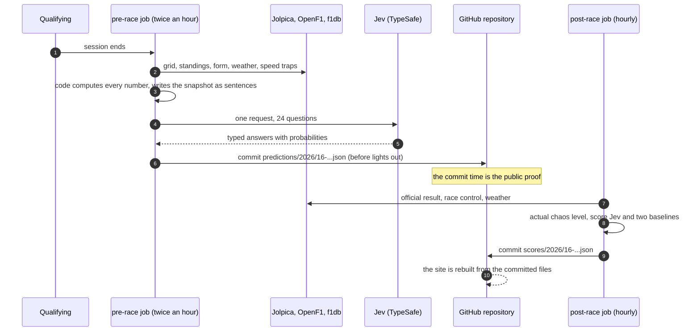
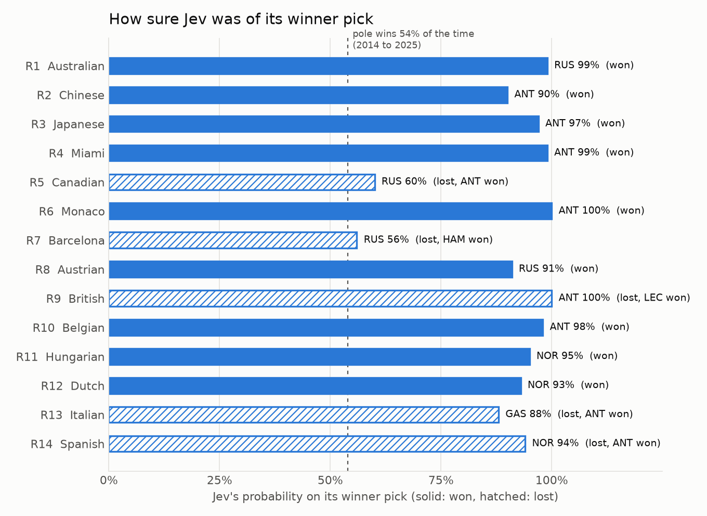
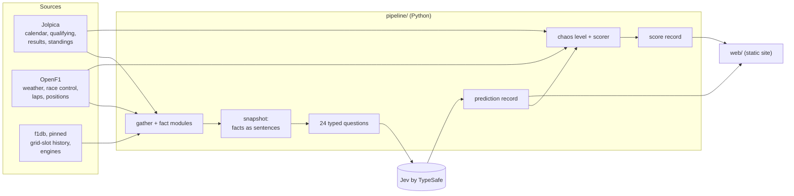

<div align="center">

# Race Calls

**Called before lights out. Scored after the flag.**

Before every Grand Prix of the 2026 season, an AI model called **Jev** makes public, timestamped calls about the race.<br>
After the race, the calls are scored against what really happened, next to two simple baselines, and the season record keeps the misses as plainly as the hits.

[](https://github.com/herambbbb/race-calls/actions/workflows/prerace.yml)
[](https://github.com/herambbbb/race-calls/actions/workflows/postrace.yml)


**Reviewing this project?** Start with the [five-minute case study](docs/case-study.md).

</div>

---

## Contents

- [What it does](#what-it-does)
- [A race weekend, step by step](#a-race-weekend-step-by-step)
- [A tour of the site](#a-tour-of-the-site)
- [Results so far](#results-so-far)
- [How it works](#how-it-works)
- [The honesty rules](#the-honesty-rules)
- [Quick start](#quick-start)
- [Commands](#commands)
- [Project layout](#project-layout)
- [Tech stack](#tech-stack)
- [Data sources and credits](#data-sources-and-credits)
- [Status](#status)
- [Documentation](#documentation)
- [License](#license)
- [Disclaimer](#disclaimer)

## What it does

After qualifying, a Python pipeline gathers the facts of the weekend, writes them as plain sentences, and asks [Jev](docs/jev.md), a decision model by [TypeSafe](https://docs.typesafe.ai), three kinds of question **in a single request**:

| Call | Question type | What Jev returns |
|---|---|---|
| **Podium chance** for every driver | `noul` (yes or no), one per driver | "Will Lando Norris finish in the top three?" 74% |
| **Winner pick** over the whole grid | `choice` | Norris, with a probability for every driver |
| **Chaos rating** of the race | `score` on a fixed five-level rubric | 0.92 on a scale from 0 (calm) to 4 (bedlam) |

The prediction is **committed to this public repository before lights out**; the commit time is the proof. After the race, the calls are scored against the official result and two baselines (the history of each grid slot, and recent form), and the leaderboards update.

Jev returns numbers, not reasons. So the site shows exactly **what Jev knew** (the facts it was given) next to what it answered, and never invents an explanation.

## A race weekend, step by step



Both jobs run on GitHub Actions and decide from the calendar what to do, so odd timetables (a Saturday-night race in Las Vegas) need no special cases. Details: [automation](docs/automation.md).

## A tour of the site

The site is a static React app built from the committed prediction and score files. There are no accounts, no live API calls, and no keys in the build. Run it locally with `cd web && pnpm dev`. Every page is described in [docs/site.md](docs/site.md).

<table>
<tr>
<td width="50%"><br><b>Race page.</b> When the call was made, with a link to its public commit history. Calls and the result stay hidden behind a button until you choose to see them.</td>
<td width="50%"><br><b>The winner question.</b> One pick and a full distribution over the grid, with the real winner marked.</td>
</tr>
<tr>
<td><br><b>Chaos.</b> Jev's call against the actual level, with the rubric exactly as Jev saw it and the reason for the actual level.</td>
<td><br><b>After the flag.</b> The real podium, the scorecard against both baselines, and every call against what happened.</td>
</tr>
<tr>
<td><br><b>What Jev knew.</b> The exact facts Jev was given, race by race and driver by driver.</td>
<td><br><b>Leaderboards.</b> Jev against both baselines, with the sample size as the loudest number and a note on uncertainty.</td>
</tr>
<tr>
<td><br><b>Technical board.</b> Every metric, per race and per side, with aggregates and calibration error.</td>
<td><br><b>Calls vs reality.</b> The probability Jev gave to what actually happened, for every criterion.</td>
</tr>
</table>

## Results so far

> [!IMPORTANT]
> These are **backtests**: rounds 1 to 14 of 2026, predicted after the races. Jev was built on 17 September 2026 and may have seen these results, so they test the pipeline, not the model's skill. The live season starts with round 16 on 4 October 2026 and has its own leaderboard.

| 14 backtests | Podium Brier (lower is better) | Winner log loss (lower is better) | Winner picks right | Podium picks right | Chaos error |
|---|---|---|---|---|---|
| **Jev** | 0.0665 | 2.44 | 9 of 14 | 26 of 42 | 0.82 |
| **Grid baseline** | 0.0673 | 1.21 | 9 of 14 | 26 of 42 | no call |
| **Form baseline** | 0.0906 | 2.53 | 4 of 14 | 24 of 42 | no call |



What the backtests show ([full findings](docs/findings.md)):

1. **The podium calls are good.** Jev matches the grid-slot history on podium Brier, and its podium chances are well calibrated (expected calibration error 0.045 over 303 calls).
2. **The winner pick is the weak spot.** It was the pole-sitter in all 14 races, usually at 90 to 100%, and confidently wrong in the five races pole did not win.
3. **Jev underestimates chaos.** Its chaos call was below the actual level in 13 of 14 races.
4. **The answers can contradict each other.** In 12 of 14 races some driver's win chance was higher than their podium chance, because questions in one request cannot see each other's answers.
5. **Richer facts helped.** Adding teammate, engine, speed-trap, and similar-circuit facts improved every metric on a re-run and brought the podium chances to sum to 3.02.

> [!NOTE]
> **Read every number with care.** It is a sport: a safety car, a first-lap crash, a shower, or a penalty can decide a race. The samples are tiny, the 22 podium calls in a race are not independent, the inputs are imperfect, and the backtests may be memorised. More in [how much to trust the numbers](docs/scoring.md#how-much-to-trust-the-numbers).

## How it works



- **Code computes every number** (gaps to pole, points, finishing streaks, historical rates) and writes it into a sentence. Jev never does arithmetic. ([pipeline](docs/pipeline.md))
- **One request per race**: 22 podium nouls, a winner choice, and a chaos score over the same state. ([Jev](docs/jev.md))
- **Scored against the official result** with podium Brier, winner log loss and hit, podium picks, and chaos error, for Jev and two baselines. ([scoring](docs/scoring.md))
- **Everything is a file in git**: predictions, scores, priors, and the contracts that keep the pipeline and the site in step. ([data formats](docs/data-formats.md))

## The honesty rules

| Rule | Where it is enforced |
|---|---|
| Nothing from the race itself can enter the snapshot | leak guards in [`snapshot.py`](pipeline/src/race_calls/snapshot.py) and every fact module |
| A call made at or after the start is published but **never scored** | [`predict.py`](pipeline/src/race_calls/predict.py), and at scoring time against race control's real lights out in [`score.py`](pipeline/src/race_calls/score.py) |
| A saved prediction is **never rewritten** | [`predict.write_record`](pipeline/src/race_calls/predict.py) |
| Backtests **never count** on the season leaderboard | [`postrace.py`](pipeline/src/race_calls/postrace.py) and the site's season view |
| Jev's answers are scored **as given**, contradictions included | [`score.py`](pipeline/src/race_calls/score.py) |
| No invented reasons: the site shows inputs and outputs only | the race page's "What Jev knew" |
| No API key in logs, records, or the built site | `SecretStr` settings, redaction in [`jev.py`](pipeline/src/race_calls/jev.py), and [`check-no-secrets.mjs`](web/scripts/check-no-secrets.mjs) |

## Quick start

You need Python 3.12 with [uv](https://docs.astral.sh/uv/), and Node.js with [pnpm](https://pnpm.io). Behind a corporate TLS proxy, add `--system-certs` after `uv run` / `uv sync`.

```bash
git clone git@github.com:herambbbb/race-calls.git
cd race-calls

# Pipeline
cd pipeline
uv sync
uv run pytest -q            # fully offline: sockets are blocked in tests
uv run ruff check . && uv run mypy

# Site
cd ../web
pnpm install
pnpm test && pnpm build     # the build fails if any API key appears in it
pnpm dev                    # http://localhost:5173
```

To make real predictions, put your key in `.env` at the repository root (it is git-ignored; never commit it):

```bash
cp .env.example .env        # then set TYPESAFE_API_KEY in .env
```

Full setup, conventions, and troubleshooting: [development](docs/development.md).

## Commands

Run from `pipeline/` with `uv run`:

| Command | What it does |
|---|---|
| `rc prerace` | The pre-race job: predict any race whose qualifying is over, or give up an hour before the start |
| `rc predict --season 2026 --round 16` | Predict one race now (the manual fallback) |
| `rc postrace` | The post-race job: score every live race whose result is official |
| `rc score --season 2026 --round 16` | Score one race (`--force` to rescore) |
| `rc backtest --first 1 --last 14` | Predict past rounds as labelled backtests |
| `rc score-backtests` | Score the backtests |
| `rc priors` | Rebuild the grid-slot history from the pinned f1db release |

## Project layout

```text
race-calls/
├── pipeline/                 Python: data, facts, Jev, scoring, CLI (race_calls package)
│   ├── src/race_calls/       jolpica.py, openf1/, priors.py, facts/, snapshot.py, questions.py,
│   │                         jev.py, predict.py, chaos.py, score.py, postrace.py, cli.py
│   └── tests/                fully offline tests, with real captured fixtures
├── web/                      the static site (Vite, React 19, TypeScript, Tailwind 4)
├── predictions/              committed prediction records (2026/ live, backtest/)
├── scores/                   committed score records (2026/ live, backtest/)
├── priors/                   grid-slot history, engines, circuit traits
├── contracts/                JSON schemas and examples shared by the pipeline and the site
├── docs/                     this documentation, screenshots, and the chart script
├── openspec/                 the plan: proposal, design, specs, tasks
└── .github/workflows/        pre-race and post-race jobs
```

## Tech stack

| Area | Tools |
|---|---|
| Pipeline | Python 3.12, uv, httpx with the OS certificate store (truststore), pydantic and pydantic-settings, Typer, pytest with respx, ruff, mypy strict |
| Model | Jev `jev-1.13.0` through TypeSafe's API (OpenRouter's decisions endpoint as a fallback) |
| Site | Vite 8, React 19, TypeScript strict, Tailwind 4, oxlint, vitest, pnpm |
| Automation | GitHub Actions: two scheduled workflows that commit their own output |
| Planning | [OpenSpec](https://github.com/Fission-AI/OpenSpec) |

## Data sources and credits

- [Jolpica](https://github.com/jolpica/jolpica-f1): calendar, qualifying, results, and standings (Ergast-compatible). Cached and rate limited.
- [OpenF1](https://openf1.org): weather, race control, laps, and positions. Free historical data 30 minutes after a session.
- [f1db](https://github.com/f1db/f1db), pinned release `v2026.15.1`: historical grid-slot rates (2014 to 2025) and engine suppliers.
- Circuit outlines from the open f1-circuits dataset by Tomislav Bacinger (MIT licence).
- Jev by [TypeSafe](https://docs.typesafe.ai).
- Fonts: Satoshi (Fontshare, loaded from its CDN and not committed, per its licence) and Instrument Serif (SIL Open Font Licence).

## Status

A personal learning project. The pipeline, scoring, both workflows, and the site are built and tested; the backtests are scored. The live season:

| Round | Race | Date (race) |
|---|---|---|
| 16 | Bahrain Grand Prix in Malaysia (Sepang) | 4 October 2026 |
| 17 | Singapore Grand Prix (sprint weekend) | 11 October 2026 |
| 18 | United States Grand Prix | 25 October 2026 |
| 19 | Mexico City Grand Prix | 1 November 2026 |
| 20 | Brazilian Grand Prix | 8 November 2026 |
| 21 | Las Vegas Grand Prix | 22 November 2026 |
| 22 | Qatar Grand Prix | 29 November 2026 |
| 23 | Abu Dhabi Grand Prix | 6 December 2026 |

Exact session times always come from the calendar, never from this table.

## Documentation

| | |
|---|---|
| [Case study](docs/case-study.md) | the five-minute read: problem, decisions, results, lessons |
| [Architecture](docs/architecture.md) | components, data flow, design principles |
| [Pipeline](docs/pipeline.md) | data sources, facts, the snapshot, the CLI |
| [Jev](docs/jev.md) | the model, the questions, a real request and response |
| [Scoring](docs/scoring.md) | every metric, the chaos rubric, baselines, uncertainty |
| [Automation](docs/automation.md) | the workflows and the race-weekend runbook |
| [Site](docs/site.md) | every page, with screenshots |
| [Data formats](docs/data-formats.md) | every committed file |
| [Findings](docs/findings.md) | what the backtests show, with charts |
| [Development](docs/development.md) | setup, checks, conventions |

## License

The code and documentation are released under the [MIT License](LICENSE).

Third-party material in this repository keeps its own terms, and the MIT License does not cover it:

- **Data**: the priors (`priors/`) are derived from [f1db](https://github.com/f1db/f1db), and the test fixtures under `pipeline/tests/fixtures/` contain responses captured from [Jolpica](https://github.com/jolpica/jolpica-f1) and [OpenF1](https://openf1.org). See each project for its data terms.
- **Circuit outlines**: from the f1-circuits dataset by Tomislav Bacinger (MIT).
- **Fonts**: Instrument Serif (SIL Open Font Licence, installed from npm). Satoshi is loaded from Fontshare at runtime and is not part of this repository.

## Disclaimer

Race Calls is an unofficial, non-commercial fan project. It is not associated with the Formula 1 companies, the FIA, any team, or TypeSafe. F1, Formula 1, and related marks are trademarks of Formula One Licensing B.V. Predictions are for learning and entertainment only, never betting advice.
