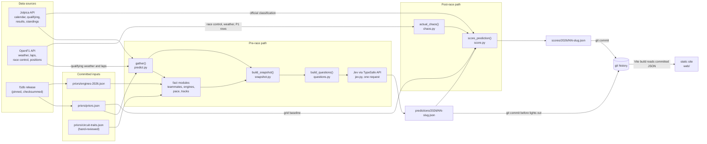
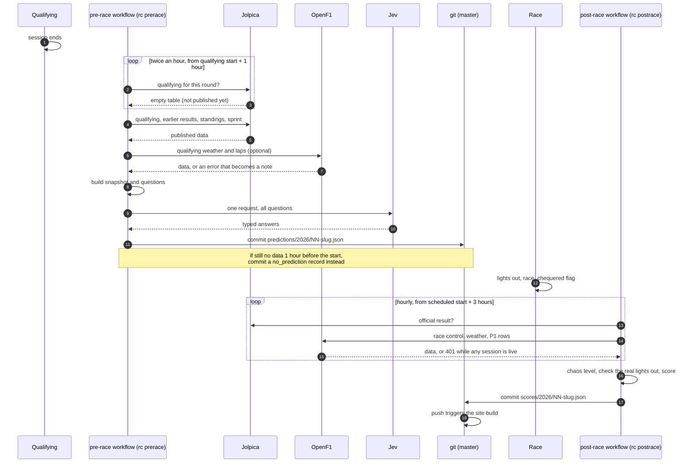

# Architecture

Race Calls on one page: what the parts are, how data moves between them, what happens
on a race weekend, where each file lives, and the rules the code enforces.

- [The system at a glance](#the-system-at-a-glance)
- [One race weekend](#one-race-weekend)
- [Repository layout](#repository-layout)
- [Design principles and where they are enforced](#design-principles-and-where-they-are-enforced)
- [Further reading](#further-reading)

## The system at a glance

Race Calls is a batch pipeline, not a service. Two scheduled GitHub Actions jobs run
the Python command-line tool `rc`; everything it produces is a JSON file committed to
the repository. The web site is built from those committed files, so the git history
is the database and the commit time is the proof that a prediction came before the race.



In words:

1. **Priors** are built offline from a pinned [f1db](https://github.com/f1db/f1db)
   release and committed (`rc priors`, `python -m race_calls.facts.engines`). They change
   rarely and are never fetched during a race weekend.
2. **Pre-race**: once qualifying is published on Jolpica, `gather()` collects everything
   known before the race, the fact modules turn it into sentences, and `build_snapshot()`
   assembles the text Jev reads. `build_questions()` adds the three kinds of typed
   question, and `make_prediction()` sends them to Jev in one request. The result is a
   `PredictionRecord` written to `predictions/`.
3. **Post-race**: once the official result is on Jolpica and race control is on OpenF1,
   `actual_chaos()` rates the race on the chaos rubric and `score_prediction()` scores Jev
   and two baselines. The result is a `ScoreRecord` written to `scores/`.
4. **Publishing**: the workflows commit and push each new file. The site's Vite plugin
   ([`web/plugins/predictions.ts`](../web/plugins/predictions.ts)) reads the committed
   JSON at build time. See [site.md](site.md).

## One race weekend

Times are illustrative. Both jobs run hourly every day and decide from the calendar
whether anything is due, so odd timetables (a Saturday-night race, a moved start) need
no special handling. Schedules and workflow details are in [automation.md](automation.md).



## Repository layout

```text
race-calls/
├── pipeline/                      Python package and tests (uv project)
│   ├── pyproject.toml             dependencies; defines the `rc` command
│   ├── src/race_calls/
│   │   ├── cli.py                 `rc` commands: predict, prerace, backtest, score, postrace, ...
│   │   ├── settings.py            paths and API keys (SecretStr), read from env or .env
│   │   ├── http.py                shared httpx client (OS trust store, User-Agent)
│   │   ├── cache.py               JSON file cache under data/cache (gitignored)
│   │   ├── jolpica.py             Jolpica client: calendar, qualifying, results, sprint, standings
│   │   ├── openf1/                OpenF1 client, rate limiter, session lookup, race-control rules
│   │   ├── priors.py              downloads the pinned f1db release, builds priors/priors.json
│   │   ├── facts/                 teammates, engines, pace, tracks: extra snapshot sentences
│   │   ├── snapshot.py            the pre-race snapshot and its leak guards
│   │   ├── questions.py           the typed questions and the answer parser
│   │   ├── rubric.py              the five chaos rubric lines, shared by question and scorer
│   │   ├── jev.py                 Jev HTTP client, transports, retry policies
│   │   ├── predict.py             gather(), make_prediction(), record writing, the pre-race schedule
│   │   ├── models.py              every data contract (pydantic), including the committed records
│   │   ├── contracts.py           writes contracts/*.schema.json from models.py
│   │   ├── chaos.py               the actual chaos level of a finished race
│   │   ├── score.py               scoring against the result and two baselines
│   │   ├── metrics.py             Brier score, log loss, top pick
│   │   └── postrace.py            which races are due for scoring, and scoring one
│   └── tests/                     offline pytest suite, with recorded fixtures
├── predictions/
│   ├── 2026/                      live prediction records (created by the first live run)
│   └── backtest/                  backtest records, rounds 1 to 14 of 2026
├── scores/
│   ├── 2026/                      live score records
│   └── backtest/                  backtest score records
├── priors/
│   ├── priors.json                grid-slot rates and circuit history (from f1db)
│   ├── engines-2026.json          power unit per constructor (from f1db)
│   └── circuit-traits.json        circuit traits (this project's own judgement)
├── contracts/                     JSON schemas and examples shared by pipeline and site
├── web/                           React and Vite static site (see site.md)
├── docs/                          this documentation
├── openspec/changes/              the design (design.md), specs, and task list
├── .github/workflows/             prerace.yml and postrace.yml
├── data/                          local cache, f1db downloads, logs (gitignored)
└── .env.example                   the names of the settings; the real .env is gitignored
```

## Design principles and where they are enforced

Each principle is a rule the code checks, not only a convention. The links point at the
function that enforces it.

### Code computes every number

Jev reads sentences such as "drivers finished in the top three 81% of the time"; it is
never handed a table to do arithmetic on. Every number in the snapshot is computed in
Python and formatted into a sentence.

- [`snapshot.py`](../pipeline/src/race_calls/snapshot.py): `_driver_line`, `_race_lines`
- the fact modules in [`facts/`](../pipeline/src/race_calls/facts/): `teammate_facts`,
  `engine_facts`, `pace_facts`, `similar_track_facts`
- [`questions.py`](../pipeline/src/race_calls/questions.py): `build_questions` puts no
  facts in the question text; the only numbers there are the rubric's own thresholds
- Test: `test_every_number_in_the_text_is_there_as_a_sentence_not_a_table` in
  [`test_snapshot.py`](../pipeline/tests/test_snapshot.py)

### One request per race

All podium questions (one per driver), the winner choice, and the chaos score go in a
single request body, so a race costs one call and all answers come from the same view
of the facts. Retries resend the identical body.

- [`predict.py`](../pipeline/src/race_calls/predict.py): `make_prediction` builds one body
  and calls `client.send` once
- [`jev.py`](../pipeline/src/race_calls/jev.py): `JevClient.send` retries the same body
  under a `RetryPolicy`
- Test: `test_one_request_and_a_complete_record` in
  [`test_predict.py`](../pipeline/tests/test_predict.py)

### No race-day data in the snapshot

A prediction is only honest if nothing from the race could reach it. The builder has no
parameter for the race's own result, and every input is checked by round number; a
violation raises `LeakError`, which is fatal (it is not caught and turned into a note).

- [`snapshot.py`](../pipeline/src/race_calls/snapshot.py): `_check_inputs` rejects priors
  that reach into the current season, circuit history that includes it, results or
  standings from this round or later, and a sprint result from another weekend
- [`predict.py`](../pipeline/src/race_calls/predict.py): `gather` only asks for rounds
  before this one and standings after `round - 1`
- [`facts/teammates.py`](../pipeline/src/race_calls/facts/teammates.py),
  [`facts/engines.py`](../pipeline/src/race_calls/facts/engines.py),
  [`facts/tracks.py`](../pipeline/src/race_calls/facts/tracks.py): each `_check_inputs` or
  equivalent rejects a result keyed at or after this round, or filed under the wrong key
- [`facts/pace.py`](../pipeline/src/race_calls/facts/pace.py): `_usable` rejects laps from
  more than one session
- Tests: `test_no_race_day_data_can_enter` and
  `test_the_builder_has_no_way_to_receive_race_results` in
  [`test_snapshot.py`](../pipeline/tests/test_snapshot.py);
  `test_a_leak_inside_a_fact_module_stops_the_prediction` and
  `test_gather_asks_only_for_earlier_rounds` in
  [`test_predict.py`](../pipeline/tests/test_predict.py)

### Records are immutable once final

An `ok` or `no_prediction` record is never replaced; only a `failed` record (Jev was
unreachable) may be overwritten, so the next hourly run can try again. Scores are not
overwritten either, unless a person runs `rc score --force`.

- [`predict.py`](../pipeline/src/race_calls/predict.py): `write_record` raises
  `RecordExists` unless the existing record is `failed`
- [`cli.py`](../pipeline/src/race_calls/cli.py): `Context.done` treats any non-failed
  record as done, so `prerace`, `predict`, and `backtest` skip it
- [`score.py`](../pipeline/src/race_calls/score.py): `write_score` raises `ScoreExists`
  unless `force=True`
- Test: `test_records_are_final_except_failures` in
  [`test_predict.py`](../pipeline/tests/test_predict.py)

### Late calls are never scored

A live record written at or after the scheduled start is marked `late` and published
but never scored. Because a calendar can be wrong (2026 Miami ran at 17:00Z while
Jolpica still said 20:00Z), the scorer also compares `made_at` with the real lights out
read from race control, and refuses a call made after it.

- [`predict.py`](../pipeline/src/race_calls/predict.py): `_base` sets
  `late = kind is live and made_at >= race_start`
- [`postrace.py`](../pipeline/src/race_calls/postrace.py): `scoring_due` skips late,
  failed, and no-prediction records
- [`chaos.py`](../pipeline/src/race_calls/chaos.py): `actual_chaos` sets `lights_out` to
  the first `SESSION STARTED` message
- [`score.py`](../pipeline/src/race_calls/score.py): `score_prediction` raises
  `NotScorable` for a late record and for a live record with `made_at >= lights_out`
- Tests: `test_late_failed_and_missing_predictions_are_never_scored` and
  `test_a_live_call_after_the_real_lights_out_is_never_scored` in
  [`test_score.py`](../pipeline/tests/test_score.py)

### Backtests are kept apart

Races on or before the model's build date (17 September 2026) may be in Jev's training
data, so they are backtests: stored in separate folders, never picked up by the hourly
jobs, and never on the live leaderboard.

- [`predict.py`](../pipeline/src/race_calls/predict.py): `kind_for` (the cutoff is the
  date in the reported model id, else `KNOWN_MODEL_DATE`), `record_path` (the `backtest/`
  folder), and `due`, which skips backtests
- [`postrace.py`](../pipeline/src/race_calls/postrace.py): `scoring_due` only takes
  `kind == live`
- [`score.py`](../pipeline/src/race_calls/score.py): `score_path` mirrors the folders
- [`cli.py`](../pipeline/src/race_calls/cli.py): `backtest` refuses rounds after the cutoff
- Tests: `test_backtests_are_stored_apart` and `test_due_skips_backtests` in
  [`test_predict.py`](../pipeline/tests/test_predict.py)

### Keys are never logged

API keys are held as pydantic `SecretStr`, sent only in the `Authorization` header, and
redacted from any error text before it can land in a record or a log.

- [`settings.py`](../pipeline/src/race_calls/settings.py): `Settings` stores keys as
  `SecretStr`; `jev_api_key` picks the one for the chosen transport
- [`jev.py`](../pipeline/src/race_calls/jev.py): `JevClient.send` replaces the key with
  `[redacted]` in a rejected response's text; `JevError` never carries it
- [`.github/workflows/prerace.yml`](../.github/workflows/prerace.yml): the secret is
  passed only to the one step that calls Jev; the post-race job has no key at all
- [`web/scripts/check-no-secrets.mjs`](../web/scripts/check-no-secrets.mjs): fails the
  site build if a key value appears in `dist/`
- Tests: `test_rejected_request_is_not_retried_and_the_key_is_redacted` and
  `test_key_never_appears_in_a_response` in [`test_jev.py`](../pipeline/tests/test_jev.py)

### Tests are fully offline

No test can reach Jolpica, OpenF1, f1db, or Jev, spend on a real key, or overwrite a
committed record.

- [`tests/conftest.py`](../pipeline/tests/conftest.py): the autouse fixture
  `offline_and_isolated` makes every socket connect raise, blanks every API key, and
  points `DATA_DIR`, `PREDICTIONS_DIR`, and `SCORES_DIR` at a temporary directory. HTTP is
  mocked with `respx`, which never opens a socket.
- Run them with `cd pipeline && uv run --system-certs pytest -q` (see
  [development.md](development.md)).

## Further reading

- [pipeline.md](pipeline.md): data sources and the pre-race path in depth
- [data-formats.md](data-formats.md): every committed file format
- [jev.md](jev.md): the Jev request and response
- [scoring.md](scoring.md): scoring formulas, baselines, and the chaos rubric
- [automation.md](automation.md): the workflows and their schedules
- [site.md](site.md): the web app
- [`design.md`](../openspec/changes/add-race-weekend-predictions/design.md): the rationale
  behind each decision
