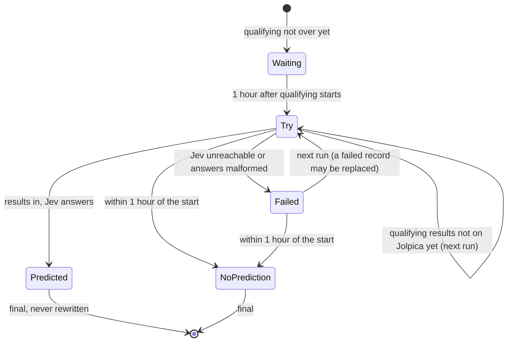

# Automation: the two hourly jobs, and the race-weekend runbook

- [Why hourly jobs driven by the calendar](#why-hourly-jobs-driven-by-the-calendar)
- [The pre-race job](#the-pre-race-job)
- [The post-race job](#the-post-race-job)
- [Proof that the call came first](#proof-that-the-call-came-first)
- [Race-weekend runbook](#race-weekend-runbook)
- [Running it by hand](#running-it-by-hand)
- [Troubleshooting](#troubleshooting)

Workflows: [`.github/workflows/prerace.yml`](../.github/workflows/prerace.yml), [`.github/workflows/postrace.yml`](../.github/workflows/postrace.yml). Logic: [`predict.due`](../pipeline/src/race_calls/predict.py), [`postrace.scoring_due`](../pipeline/src/race_calls/postrace.py), [`cli.py`](../pipeline/src/race_calls/cli.py).

## Why hourly jobs driven by the calendar

Race weekends do not share a timetable: Las Vegas races on Saturday night local time (Sunday 04:00 UTC), Singapore at night, Qatar in the evening. Instead of a schedule per race, both jobs run on a fixed cron **every day** and ask the calendar (from Jolpica) whether anything is due. A run with nothing to do exits in seconds. Session times are never hard-coded in the pipeline.

| Job | Cron (UTC) | Needs a key | Commits |
|---|---|---|---|
| `pre-race` | `17 * * * *` and `47 * * * *` (twice an hour) | yes, `TYPESAFE_API_KEY` | `predictions/` only |
| `post-race` | `37 * * * *` (hourly) | no | `scores/` only |

Both share the concurrency group `predictions`, so they never run at the same time and never race each other's pushes. Commits are made as `github-actions[bot]`. Both can also be started by hand from the Actions tab (`workflow_dispatch`).

Why twice an hour for the pre-race job: GitHub may start scheduled runs late under load, and the window between the end of qualifying and the give-up time is what matters. Two slots an hour halve the exposure.

## The pre-race job

`rc prerace` looks at every live race in the calendar and decides:



- **Try** (from one hour after qualifying starts, which is about when it ends): if Jolpica has the qualifying results, gather the facts, send one Jev request, and write the record. If not, do nothing; the next run tries again.
- **Give up** one hour before the scheduled start: if there is still no final record, write a `no_prediction` record ("qualifying data did not arrive in time") rather than predict from incomplete data.
- **Retry budget**: Jev's patient retries (up to about 45 minutes of waiting) are cut so they can never run past the give-up time.
- **Final means final**: an `ok` or `no_prediction` record is never overwritten. Only a `failed` record can be replaced by a later attempt.
- **Backtests are never touched** by this job: races on or before the model's date are skipped.

A record made at or after the scheduled start is still written (so a manual run is never lost), but it is marked `late` and never scored.

## The post-race job

`rc postrace` looks for live races that started more than **three hours** ago, have an on-time `ok` prediction, and have no score yet. For each one:

1. fetch the official classification from Jolpica (none yet: "waiting");
2. find the race session on OpenF1 and compute the actual chaos level from race control, weather, and position data (a live-session lockout or no session yet: "waiting");
3. score Jev and both baselines ([scoring](scoring.md)) and write `scores/<season>/<round>-<slug>.json`.

A race whose data looks wrong (for example no full podium in the classification) is reported and skipped, so it cannot block the other races due in the same run.

## Proof that the call came first

- The prediction file is committed to the public repository **before lights out**. GitHub shows the commit time, and the site links every race to its file's commit history.
- The record also carries its own `made_at` timestamp and the SHA-256 of the exact request body sent to Jev.
- Records are never edited after they are final; a changed record would show up in the git history.

## Race-weekend runbook

For each live race (times in UTC, from the calendar):

| When | What should happen | What to check |
|---|---|---|
| Before the weekend | nothing | The last `pre-race` and `post-race` runs are green in the Actions tab. `gh secret list` shows `TYPESAFE_API_KEY`. |
| Qualifying ends (about start + 1 h) | the next `pre-race` run tries | Run log says "qualifying results are not published yet" until Jolpica updates, then a line like `Round 16 ...: ok (live)`. |
| Soon after qualifying | a commit "Prediction: 16-...json" lands on `master` | The file exists under `predictions/2026/` with `"status": "ok"` and `"late": false`. |
| If no prediction by about 2 hours after qualifying | | Start `pre-race` by hand from the Actions tab, or use the manual fallback below. |
| Start minus 1 hour | give-up time | If there is still no record, the job writes `no_prediction`. |
| Race start + 3 hours onward | the next `post-race` run scores it | A commit "Score: 16-...json" lands; the file is under `scores/2026/`. Jolpica usually has the result within a few hours; OpenF1 within 30 minutes of the finish. |

Watch out for races moved at short notice. The pipeline takes its times from Jolpica, which is not always updated (2026 Miami ran three hours earlier than Jolpica still says). A prediction made after the real lights out is caught at scoring time and never scored, but it cannot be made earlier after the fact, so keep an eye on schedule news during the weekend.

## Running it by hand

From `pipeline/` (behind a TLS-intercepting proxy add `--system-certs` after `uv run`):

```bash
uv run rc predict --season 2026 --round 16     # the manual fallback after qualifying
uv run rc prerace --now 2026-10-03T09:30+00:00 # what the job would do at that time
uv run rc score --season 2026 --round 16       # score one race (add --force to rescore)
uv run rc postrace                             # score everything that is due
uv run rc backtest --first 1 --last 14         # past rounds, stored as backtests
uv run rc score-backtests                      # score the backtests
```

After a manual `predict` or `score`, commit the new file yourself and push, before lights out for a prediction. The commit time is the proof.

## Troubleshooting

| Symptom | Likely cause | What to do |
|---|---|---|
| "qualifying results are not published yet" for hours | Jolpica has not updated | Wait; it usually updates within an hour or two. The job gives up an hour before the start. |
| "race-control data not available yet" | OpenF1 returns 401 to everyone while any session is live, or data is not out yet (30 minutes after a session) | Wait for the next run. |
| A `failed` record with "HTTP 401" | wrong or missing `TYPESAFE_API_KEY` secret | Set it again in your own terminal: `gh secret set TYPESAFE_API_KEY --repo herambbbb/race-calls`. The next run replaces the failed record. |
| A `failed` record with "HTTP 429" or "529" after all retries | the service is busy | The next run tries again automatically, until the give-up time. |
| No scheduled runs at all | GitHub has not started the schedule, or disabled it after 60 days without repository activity | Start the workflow by hand once from the Actions tab; any push re-enables schedules. |
| "cannot score yet, needs a look" | unusual classification (no full podium) | Inspect the Jolpica result; fix by hand or rescore later with `rc score --force`. |
