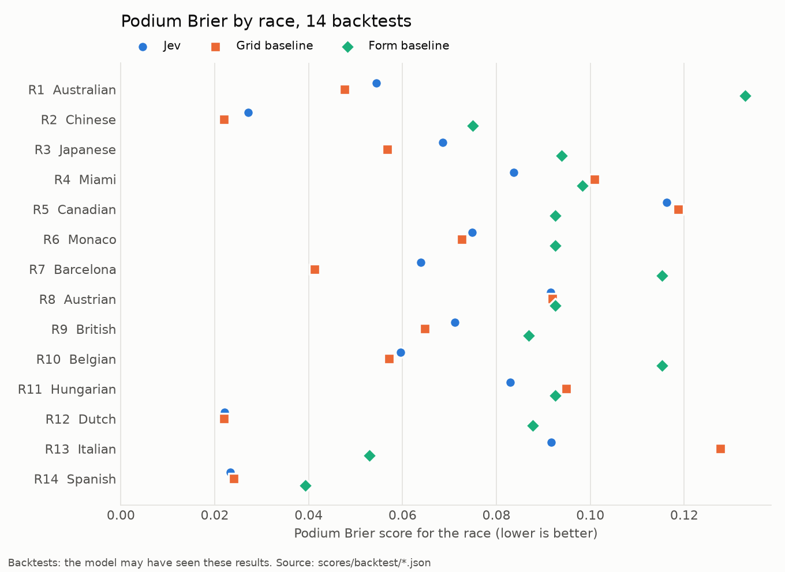
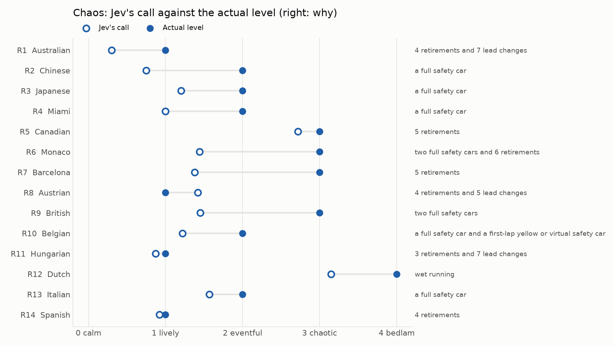

# Findings so far

- [Read this first](#read-this-first)
- [The backtest leaderboard](#the-backtest-leaderboard)
- [Race by race](#race-by-race)
- [Finding 1: the winner pick was always the pole-sitter](#finding-1-the-winner-pick-was-always-the-pole-sitter)
- [Finding 2: the podium calls are good and well calibrated](#finding-2-the-podium-calls-are-good-and-well-calibrated)
- [Finding 3: Jev underestimates chaos](#finding-3-jev-underestimates-chaos)
- [Finding 4: the answers contradict each other](#finding-4-the-answers-contradict-each-other)
- [Finding 5: richer facts helped](#finding-5-richer-facts-helped)
- [Engineering lessons](#engineering-lessons)
- [Cost and speed](#cost-and-speed)

All numbers on this page are computed from the committed files in [`predictions/backtest/`](../predictions/backtest/) and [`scores/backtest/`](../scores/backtest/), and the charts are drawn by [`figures/make_figures.py`](figures/make_figures.py). Rerun it after new races are scored.

## Read this first

These are **14 backtests**: rounds 1 to 14 of 2026, predicted on 28 September 2026, after the races had happened. Jev was built on 17 September 2026 and may have seen these results in training, so a good number here can be memory rather than skill. They test the plumbing end to end; they are not evidence that Jev can predict races. The live season starts with round 16 (4 October 2026) and has its own leaderboard. See [how much to trust the numbers](scoring.md#how-much-to-trust-the-numbers).

## The backtest leaderboard

| 14 backtests | Podium Brier (lower is better) | Winner log loss (lower is better) | Winner picks right | Podium picks right | Chaos error |
|---|---|---|---|---|---|
| **Jev** | 0.0665 | 2.44 | 9 of 14 | 26 of 42 | 0.82 |
| **Grid baseline** | 0.0673 | 1.21 | 9 of 14 | 26 of 42 | no call |
| **Form baseline** | 0.0906 | 2.53 | 4 of 14 | 24 of 42 | no call |

The grid baseline (how often each starting slot has reached the podium and won since 2014) is as good as Jev on the podium and much better on the winner. The gap between Jev and the grid on podium Brier (0.0008) is far smaller than a single race can move either number.

## Race by race

| Round | Race | Podium Brier: Jev | Grid | Form | Jev's winner pick | Real winner (Jev's chance) | Jev's podium picks right | Jev's chaos call | Actual chaos (Jev's chance) | Why |
|---|---|---|---|---|---|---|---|---|---|---|
| 1 | Australian | 0.054 | 0.048 | 0.133 | RUS 99% | RUS (99%) | 2/3 | 0.30 | 1 (6%) | 4 retirements and 7 lead changes |
| 2 | Chinese | 0.027 | 0.022 | 0.075 | ANT 90% | ANT (90%) | 3/3 | 0.75 | 2 (4%) | a full safety car |
| 3 | Japanese | 0.069 | 0.057 | 0.094 | ANT 97% | ANT (97%) | 2/3 | 1.20 | 2 (4%) | a full safety car |
| 4 | Miami | 0.084 | 0.101 | 0.098 | ANT 99% | ANT (99%) | 1/3 | 1.00 | 2 (4%) | a full safety car |
| 5 | Canadian | 0.116 | 0.119 | 0.093 | RUS 60% | ANT (40%) | 1/3 | 2.72 | 3 (4%) | 5 retirements |
| 6 | Monaco | 0.075 | 0.073 | 0.093 | ANT 100% | ANT (100%) | 2/3 | 1.44 | 3 (30%) | two full safety cars and 6 retirements |
| 7 | Barcelona | 0.064 | 0.041 | 0.115 | RUS 56% | HAM (0%) | 2/3 | 1.38 | 3 (29%) | 5 retirements |
| 8 | Austrian | 0.091 | 0.092 | 0.093 | RUS 91% | RUS (91%) | 1/3 | 1.42 | 1 (21%) | 4 retirements and 5 lead changes |
| 9 | British | 0.071 | 0.065 | 0.087 | ANT 100% | LEC (0%) | 2/3 | 1.45 | 3 (32%) | two full safety cars |
| 10 | Belgian | 0.060 | 0.057 | 0.115 | ANT 98% | ANT (98%) | 2/3 | 1.22 | 2 (4%) | a full safety car and a first-lap yellow or virtual safety car |
| 11 | Hungarian | 0.083 | 0.095 | 0.093 | NOR 95% | NOR (95%) | 1/3 | 0.87 | 1 (19%) | 3 retirements and 7 lead changes |
| 12 | Dutch | 0.022 | 0.022 | 0.088 | NOR 93% | NOR (93%) | 3/3 | 3.15 | 4 (73%) | wet running |
| 13 | Italian | 0.092 | 0.128 | 0.053 | GAS 88% | ANT (9%) | 1/3 | 1.57 | 2 (5%) | a full safety car |
| 14 | Spanish | 0.023 | 0.024 | 0.039 | NOR 94% | ANT (6%) | 3/3 | 0.92 | 1 (21%) | 4 retirements |

## Finding 1: the winner pick was always the pole-sitter

Jev's winner pick was the pole-sitter in **all 14 races**, usually with 90 to 100% confidence. Pole won 9 of those 14 races, which is why Jev got 9 winners right, exactly as many as the grid baseline. In the other five it was confidently wrong: 100% on Antonelli at Silverstone (Leclerc won, 0%), 88% on Gasly at Monza (Antonelli won, 9%), 56% on Russell in Barcelona (Hamilton won, 0%).

Pole converts to a win 54% of the time (2014 to 2025). Jev's confidence was far above that, which is exactly what winner log loss punishes: a 0% on the real winner costs 13.8 on its own. The grid baseline, which never says more than 54%, loses less when pole does not win, and that is the whole gap in log loss (2.44 against 1.21).

This looks less like memorised results (Jev picked the pole-sitter even when the pole-sitter lost) and more like the choice question collapsing onto the strongest single fact in the state. The winner call is the weakest part of the product.

## Finding 2: the podium calls are good and well calibrated

Over 303 podium calls the podium chances track reality well: 222 calls under 10% (it said 3%, 1% happened), and the 60 to 80% bands land close to the diagonal. The expected calibration error is 0.045. The middle bands have fewer than 10 calls each and are marked low-sample; they cannot say much either way. On average Jev gave the drivers who really finished on the podium a 49% chance, and the three drivers it rated highest took 26 of the 42 podium places.

## Finding 3: Jev underestimates chaos

Jev's chaos call was **below the actual level in 13 of 14 races**: its average call was 1.39, the average actual level 2.14. 2026 races have been eventful: between 2 and 6 retirements per race, and at least one full safety car in 7 of 14. On average Jev put an 18% chance on the level that actually happened. The one race it overestimated was Austria (1.42 against an actual 1). Its best call on a chaotic race was the wet Dutch Grand Prix: 3.15 against an actual 4, with 73% on bedlam.

Two likely causes, both fixable in the facts rather than the model: the snapshot says nothing about retirements or safety cars this season (the per-circuit safety car history in f1db does not exist, see [pipeline](pipeline.md)), and the new 2026 rules have made reliability worse than any history suggests.

## Finding 4: the answers contradict each other

In 12 of 14 races at least one driver's win chance was higher than their podium chance, which is impossible. Antonelli at Silverstone: 100% to win, 79% for the podium. The podium chances also sum to 2.84 on average, not 3.

This is how System One requests work: all 24 questions are answered in parallel, over the same state, without seeing each other's answers ([Jev](jev.md#why-one-request-per-race)). The raw answers are scored as given, and the contradictions are listed in every score file (`details.win_above_podium`, `details.podium_sum`) and on the site.

## Finding 5: richer facts helped

The first backtest gave Jev only the grid, gaps to pole, standings, recent form, and the grid-slot history. Because the winner pick collapsed onto pole, four more facts were added (teammate head-to-head, power unit supplier, qualifying speed trap and sector ranks, results at circuits sharing a trait) and the same 14 races were run again:

| Same 14 backtests | Podium Brier | Winner log loss | Winner picks right | Podium picks right | Podium sum |
|---|---|---|---|---|---|
| Grid facts only (published) | 0.0665 | 2.44 | 9 of 14 | 26 of 42 | 2.84 |
| Richer facts (not published) | **0.0635** | **1.64** | **10 of 14** | **28 of 42** | **3.02** |
| Grid baseline | 0.0673 | 1.21 | 9 of 14 | 26 of 42 | 3.03 |

With the richer facts the podium calls beat the grid baseline, the podium sum is almost exactly 3, and the winner pick is no longer always pole (4 of 14 picks were someone else) and less extreme (Gasly at Monza fell from 88% to 50%). It is still worse than the grid on winner log loss. Every live race uses the richer facts. The published backtests are the first run: records are final once made, so the second run was kept aside rather than overwriting them.

## Engineering lessons

- **Data sources disagree with reality.** Jolpica still lists 2026 Miami at 20:00Z; it ran at 17:00Z. The scorer now checks each live call against race control's real lights out, not the calendar.
- **Windows matter.** Rain fell in Miami a few minutes after the chequered flag. An early version counted it as wet running (level 4); the rain window now ends at the flag.
- **A timing blip is not a lead change.** At the 2024 Bahrain start, OpenF1 shows Norris "leading" for 1.2 seconds. Leaders held for under 10 seconds are ignored.
- **Transient errors look permanent.** OpenRouter once returned HTTP 520 (a Cloudflare error that clears on the next request); the client first treated it as a rejection. 520 to 524 are now retried.
- **History has holes.** f1db has no safety car data at all, so the per-circuit safety car line in the snapshot stays empty rather than guessed.
- **Leaks hide in helpful data.** The f1db release already contained 2026 races, so a backtest's circuit history counted the race being predicted. History is now capped at 2025, and the snapshot refuses priors that reach into the season.

## Cost and speed

| | Through OpenRouter (backtests) | Through TypeSafe's own API (live) |
|---|---|---|
| Requests | one per race | one per race |
| Input tokens | about 4,650 (grid facts only); about 7,600 with the richer facts | 7,304 in the one test call |
| Cost | $0.0026 for all 14 backtests; $0.0044 for the richer re-run | not reported by the API |
| Latency | median 554 ms | 1.4 s in the one test call |
