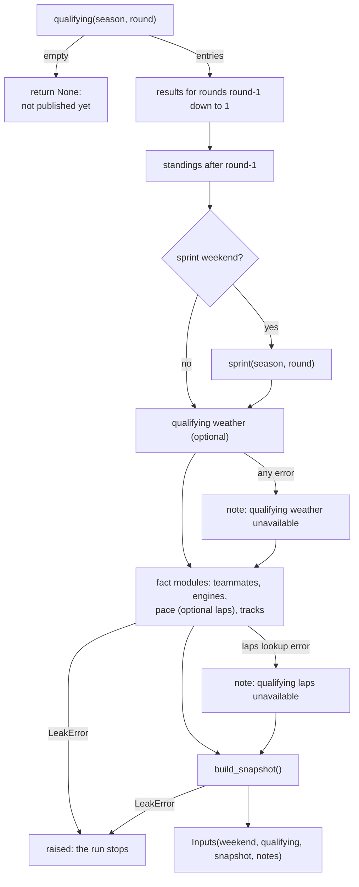

# The pipeline: data sources and the pre-race path

This page follows the data from the three sources to the snapshot Jev reads. What
happens to the snapshot next (the request and the answers) is in [jev.md](jev.md);
how a finished race is scored is in [scoring.md](scoring.md); when all of this runs is
in [automation.md](automation.md).

- [Overview](#overview)
- [Data sources](#data-sources)
  - [Shared plumbing: HTTP, cache, rate limits](#shared-plumbing-http-cache-rate-limits)
  - [Jolpica](#jolpica)
  - [OpenF1](#openf1)
  - [f1db](#f1db)
- [The priors](#the-priors)
- [The snapshot](#the-snapshot)
  - [Race lines](#race-lines)
  - [Driver lines](#driver-lines)
  - [A real snapshot](#a-real-snapshot)
- [The fact modules](#the-fact-modules)
  - [Teammates](#teammates)
  - [Engines](#engines)
  - [Pace](#pace)
  - [Tracks](#tracks)
- [The gather() flow](#the-gather-flow)
- [CLI commands](#cli-commands)

## Overview

| Source | Used for | When it is read | Code |
|---|---|---|---|
| Jolpica | calendar, qualifying, race and sprint results, standings | every run | [`jolpica.py`](../pipeline/src/race_calls/jolpica.py) |
| OpenF1 | qualifying weather and laps (pre-race); race control, weather, leader rows (post-race) | every run | [`openf1/`](../pipeline/src/race_calls/openf1/) |
| f1db | grid-slot rates, circuit history, power unit suppliers | offline, when the priors are rebuilt | [`priors.py`](../pipeline/src/race_calls/priors.py), [`facts/engines.py`](../pipeline/src/race_calls/facts/engines.py) |

The split follows a simple idea: anything that changes during a season comes from an
API at run time, and anything historical is computed once from a pinned file and
committed, so a prediction can always be traced back to exactly the numbers it saw.

## Data sources

### Shared plumbing: HTTP, cache, rate limits

- **HTTP client** ([`http.py`](../pipeline/src/race_calls/http.py), `make_client`): one
  `httpx.Client` factory for every source. It verifies TLS against the operating system's
  certificate store (via `truststore`) instead of certifi, so it works behind a corporate
  proxy that installs its own root certificate. It sends a descriptive `User-Agent`.
- **Cache** ([`cache.py`](../pipeline/src/race_calls/cache.py), `JsonCache`): one JSON file
  per response under `data/cache/<namespace>/<sha256 of the key>.json`, holding the key,
  the fetch time, and the value. The file stores its own key, so a hash collision reads as
  a miss. `get(..., max_age=...)` treats an entry older than `max_age` as missing. Writes go
  to a temporary file and are then renamed, so a crash never leaves half a file. `data/` is
  gitignored: the cache is a local courtesy to the APIs, not a record.
- **The two cache rules every caller follows**: an empty table is never cached (it usually
  means "not published yet", and caching it would hide the data once it arrives), and
  anything that can still change is cached only with a `max_age`.
- **Rate limiter** ([`openf1/ratelimit.py`](../pipeline/src/race_calls/openf1/ratelimit.py),
  `SlidingWindowLimiter`): keeps the timestamps of recent requests and, before each new
  one, sleeps until it fits inside every `(max_requests, window_seconds)` limit. A sliding
  window enforces a limit exactly: no one-second or one-minute span ever exceeds it, which
  fixed buckets cannot guarantee at their edges. Both API clients use it.

### Jolpica

[Jolpica](https://api.jolpi.ca/) is an Ergast-compatible API. Client:
[`jolpica.py`](../pipeline/src/race_calls/jolpica.py) (`JolpicaClient`).

**Endpoints** (all under `https://api.jolpi.ca/ergast/f1`, with `format=json&limit=100`):

| Method | Path | Returns |
|---|---|---|
| `calendar(season)` | `{season}/races/` | every round as a `Weekend`, with race, qualifying, sprint, and sprint qualifying start times (`SprintShootout` is read as sprint qualifying for older seasons) |
| `weekend(season, round)` | (from the calendar) | one `Weekend`, or `JolpicaError` |
| `qualifying(season, round)` | `{season}/{round}/qualifying/` | `QualifyingEntry` list with Q1, Q2, Q3 lap times; `[]` when not published |
| `results(season, round)` | `{season}/{round}/results/` | `RaceResult`, or `None` when not published |
| `sprint(season, round)` | `{season}/{round}/sprint/` | `RaceResult`, or `None` |
| `standings(season, after_round)` | `{season}/{after_round}/driverStandings/` and `.../constructorStandings/` | `Standings`, or `None` before round 1 or when not published |

Each round's file name comes from the calendar: `slugify(raceName)`, so "Spanish Grand
Prix" becomes `14-spanish-grand-prix.json`.

**Caching** (`_cached`, `_round_table`, `_round_max_age`):

| What | Max age | Why |
|---|---|---|
| Calendar | 6 hours (`CALENDAR_MAX_AGE`) | rounds can be moved or cancelled |
| Qualifying, results, sprint, standings for a round less than 7 days old | 1 hour (`RECENT_MAX_AGE`) | post-race penalties amend results and standings for a few days |
| The same, for an older round | kept, but only if fetched after the round settled | see below |
| Any empty table | never cached | it means "not published yet" |

The "settled" rule is worth a closer look. A round is treated as final 7 days after its
race start (`RECENT_RACE`). `_round_max_age` returns the time elapsed since that moment,
so a cached copy counts as fresh only if it was fetched after the round settled. A copy
fetched during the busy first week is refetched once; after that the round is never
requested again. The round's own date comes from the response itself, so no calendar
lookup is needed.

**Rate limits**: Jolpica documents a burst limit of 4 requests per second and 500 per
hour. `jolpica_limiter` stays under both with 3 per second and 400 per hour.

**Failure handling** (`_get`):

- 429 and 5xx responses are retried up to 5 times. A `Retry-After` header is honoured up
  to 60 seconds; otherwise the wait doubles from 2 seconds. Dropped connections and
  timeouts are retried the same way.
- Any other non-200 status, a body that is not JSON, or a body without `MRData` raises
  `JolpicaError`. So does a calendar entry with no race start time.
- **An empty table is not an error.** Jolpica answers a round that has not been published
  with a valid response whose table is empty. The client turns that into `[]` or `None`,
  and the caller decides: `gather()` returns `None` ("qualifying not published yet"), the
  scorer returns `None` ("the official result is not published yet"), and the next hourly
  run tries again.
- Standings for a round that has not been run can come back empty or for a different
  round, so `_standings_list` checks that the season and round match what was asked for.

**The calendar can be wrong.** Jolpica's session times are not always updated when a
race is moved. 2026 Miami ran at 17:00Z while Jolpica still listed 20:00Z (the fixture
[`tests/fixtures/jolpica/2026_races.json`](../pipeline/tests/fixtures/jolpica/2026_races.json)
keeps that value). The code accepts that the calendar is the best schedule it has and
guards the places where a wrong time would matter:

- OpenF1 sessions are matched to the calendar within 6 hours (`find_session`, see below),
  so a moved session is still found.
- A live call is checked against the real lights out from race control before it is
  scored, not only against the calendar (`score_prediction`, see
  [architecture.md](architecture.md#late-calls-are-never-scored)).
- The snapshot states the scheduled start time as Jolpica gives it. The Miami backtest
  record says "The race starts at 20:00 UTC on 3 May 2026", which was wrong.

### OpenF1

[OpenF1](https://openf1.org/) serves session data for free from 30 minutes after a
session ends ([`openf1/availability.py`](../pipeline/src/race_calls/openf1/availability.py),
`HISTORICAL_DELAY`). Client: [`openf1/client.py`](../pipeline/src/race_calls/openf1/client.py)
(`OpenF1Client`).

**Endpoints** (under `https://api.openf1.org/v1`):

| Endpoint | Params | Used by | Cache max age |
|---|---|---|---|
| `sessions` | `year`, `session_name` | `find_session` | 12 hours (`SESSIONS_MAX_AGE`): a round can be rescheduled |
| `weather` | `session_key` | `weather_summary` (qualifying), `race_wet` (race) | none: a finished session does not change |
| `laps` | `session_key` | `qualifying_laps` (pace facts) | none |
| `race_control` | `session_key` | `summarise_race_control`, lights out | none |
| `position` | `session_key`, `position=1` | lead changes | none |
| `drivers` | `session_key` | (defined, not used by the pipeline) | none |

Only non-empty lists are cached; the cache key is the endpoint plus the sorted params.

**Finding a session** ([`openf1/sessions.py`](../pipeline/src/race_calls/openf1/sessions.py),
`find_session`): the pipeline never hard-codes OpenF1 session keys. It asks for every
session of that name in the year and picks the one whose `date_start` is closest to the
Jolpica start time, within 6 hours, skipping cancelled sessions. `None` means OpenF1 has
no such session.

**Weather** (`weather_summary`): rain if any sample reported it, and the mean air and
track temperatures. OpenF1's samples start somewhat before the session, so rain just
before qualifying counts for the qualifying line.

**Rate limits**: the free tier allows 3 requests per second and 30 per minute;
`openf1_free_tier_limiter` enforces exactly that.

**Failure handling** (`_fetch`):

| Response | Result |
|---|---|
| 404 | `SessionNotFound`: no data for this session (for example a session in the future). Most callers treat it as "none". |
| 401 whose detail mentions "live" | `LiveSessionLockout`. While any session is live anywhere, OpenF1 refuses all unauthenticated requests, even for past sessions. Never retried, never cached. |
| any other 401 | `OpenF1Error` |
| 429, 500, 502, 503, 504, or a dropped connection | retried up to 5 times, waiting 2, 4, 8, 16, 32 seconds |
| a body that is not a list | `OpenF1Error` |

The live lockout matters on a race weekend, because the pre-race job can run while
another session (a support race, a practice session) is live. In the pre-race path,
weather and laps are optional, so the lockout becomes a note in the record and the
prediction goes ahead without them. In the post-race path, `rc postrace` reports "race
control data not available yet" and the next hourly run tries again.

### f1db

[f1db](https://github.com/f1db/f1db) publishes the whole championship history as CSV
releases. It is never read during a race weekend: its output is committed.

- **Pinned version** ([`priors.py`](../pipeline/src/race_calls/priors.py)):
  `F1DB_VERSION = "v2026.15.1"`, asset `f1db-csv.zip`, from
  `https://github.com/f1db/f1db/releases/download/v2026.15.1/f1db-csv.zip`.
- **Checksum**: `F1DB_SHA256 = "56c42ec173ee25d88457acf2378cbfbdd3aafbf97724f0d4eafbe71ae4b1f133"`.
  `download_f1db` downloads into `data/f1db/`, verifies the SHA-256, and raises
  `ChecksumError` on a mismatch; a cached archive is reused only if its checksum still
  matches. Pinning and checking means the priors can be rebuilt byte for byte later, and a
  silently changed release cannot slip in.
- **Files read**: `f1db-races-starting-grid-positions.csv`, `f1db-races-race-results.csv`,
  and `f1db-races.csv` for the priors; `f1db-engine-manufacturers.csv`,
  `f1db-seasons-entrants-engines.csv`, and `f1db-races-race-results.csv` for the power
  units. Sprint files are never read.
- **Circuit ids** differ between Jolpica and f1db (`albert_park` is `melbourne`), so
  `JOLPICA_TO_F1DB` maps the 2026 calendar plus Bahrain and Imola. Constructor ids are
  mapped the same way in `JOLPICA_TO_F1DB_CONSTRUCTOR` ([`facts/engines.py`](../pipeline/src/race_calls/facts/engines.py)).

## The priors

`rc priors` (or `python -m race_calls.priors`) runs `build_priors` and writes
[`priors/priors.json`](../priors/priors.json). The format is in
[data-formats.md](data-formats.md#priorspriorsjson).

**Grid-slot rates** (`GridSlotRate`): for each starting slot, how many drivers started
there, how many finished in the top three, and how many won, over every championship
race from 2014 to 2025.

- The slot is f1db's starting grid position. A pit-lane start (`positionText == "PL"`) is
  slot 0.
- A driver classified `DNS` (did not start) or `DNP` (did not take part) never took the
  start, so they are not counted, even if the starting grid lists them. A driver missing
  from the starting grid is skipped too.
- 2014 is the first season because it is the start of the current points and grid format
  (design Decision 4). As a sense of scale: slot 1 has 251 starts, 204 podiums, and 135
  wins (81% and 54%).

**Circuit history** (`CircuitHistory`): for each Jolpica circuit id, how many
championship races it has held (all years, not only from 2014) and the last season. The
safety car fields (`safety_car_races`, `safety_car_seasons`, `safety_car_source`) exist
but are empty: this f1db release has no safety car or red flag data.

**The 2025 cap, and why.** The pinned release is `v2026.15.1`, so it already contains
2026 races up to round 15. If the priors included 2026, a backtest of, say, round 10 would
be predicted with rates that include round 10's own result, and a circuit's `last_held`
would say 2026, which is the race itself. So `build_priors` stops at
`LAST_SEASON = 2025` for both the rates and the circuit history (each circuit hosts at
most once a season, so capping the season is enough), and the snapshot refuses priors
that do not respect it: `_check_inputs` in [`snapshot.py`](../pipeline/src/race_calls/snapshot.py)
raises `LeakError` if `priors.seasons[1] >= weekend.season` or if the circuit's
`last_held >= weekend.season`. For the live 2026 races the cap costs nothing, because
2026 is a new set of technical rules and its early races say little about grid-slot odds.

## The snapshot

`build_snapshot` in [`snapshot.py`](../pipeline/src/race_calls/snapshot.py) turns the
gathered inputs into a `Snapshot`: a list of race-level sentences and one line per
driver, in grid order. Its `text` property is what Jev receives as `state`:

```text
<race line 1>
<race line 2>
...

Drivers, in grid order:
<driver line for grid 1>
<driver line for grid 2>
...
```

The snapshot is always built from pre-race inputs only. `build_snapshot` has no
parameter for the race's own result, and `_check_inputs` rejects any input that could
carry information from the race (see [the priors](#the-priors) and
[architecture.md](architecture.md#no-race-day-data-in-the-snapshot)).

### Race lines

In this order (`_race_lines`), followed by the race-level lines from the fact modules:

1. The race, its round out of the season's rounds, the circuit, locality, and country.
2. The scheduled start in UTC and the number of drivers on the grid.
3. The grid is provisional: the qualifying order, without penalties announced later.
4. The season is the first under new technical rules, so the historical rates are a
   rough guide.
5. Circuit history: "has held N championship races, most recently in Y", or "has not
   held a championship race before". A safety car line follows only if the priors have
   safety car data, which they currently do not.
6. On a sprint weekend: the top eight classified sprint finishers, or a line saying the
   sprint result is not available.
7. Qualifying weather: dry or wet, with mean air and track temperatures, or "not
   available".
8. The top five of the constructors' championship after the previous round, if there is
   one.

### Driver lines

`_driver_line` writes, for each driver:

1. Name, team, and grid slot; "on pole" for slot 1, otherwise the gap from the driver's
   best qualifying lap (the fastest of Q1, Q2, Q3) to the pole-sitter's, in seconds, or
   "set no qualifying lap time".
2. Championship position, points, and wins after the previous round, or "has no
   championship points yet".
3. The last three races, most recent first: "finished 4th", or `retired`, `withdrew`,
   `was disqualified`, `was not classified`, `was excluded`, `failed to qualify`, or "did
   not race in" when the driver has no entry.
4. The grid-slot prior: "From 3rd on the grid in 2014 to 2025, drivers finished in the
   top three 55% of the time and won 11% of the time (251 starts)."

Then the driver's sentences from the fact modules, in a fixed order: teammate, power
unit, pace, similar tracks.

The grid is the qualifying order (sorted by `position`, numbered from 1). Grid
penalties announced after qualifying are not applied, so `grid_provisional` is always
`true`, and the record keeps it so the site can say so.

### A real snapshot

This is `extra.snapshot` from
[`predictions/backtest/14-spanish-grand-prix.json`](../predictions/backtest/14-spanish-grand-prix.json).
The backtests were made on 2026-09-28 before the fact modules existed (design Decision
2b was added after them), so it shows only the base lines; the next section shows the
sentences the fact modules add.

```jsonc
{
  "season": 2026,
  "round": 14,
  "race_name": "Spanish Grand Prix",
  "built_at": "2026-09-28T08:58:48.448567Z",
  "grid_provisional": true,
  "race_lines": [
    "Race: the Spanish Grand Prix, round 14 of 23 in the 2026 season, at Madring (Madrid, Spain).",
    "The race starts at 13:00 UTC on 13 September 2026, with 20 drivers on the grid.",
    "The grid is provisional: it is the qualifying order, and grid penalties announced after qualifying are not included.",
    "The 2026 season is the first under new technical rules, so the historical rates below come from 2014 to 2025 and are only a rough guide.",
    "This circuit has not held a championship race before.",
    "Qualifying was dry (air 31 C, track 54 C).",
    "Constructors' championship after round 13: 1st Mercedes 468 points; 2nd Ferrari 346 points; 3rd McLaren 287 points; 4th Red Bull 204 points; 5th RB F1 Team 75 points."
  ],
  "drivers": [
    {
      "code": "NOR",
      "name": "Lando Norris",
      "constructor": "McLaren",
      "grid": 1,
      "line": "Lando Norris (McLaren) starts 1st, on pole. Norris is 4th in the championship with 171 points, with 2 wins. Last 3 races: finished 4th in the Italian Grand Prix; finished 1st in the Dutch Grand Prix; finished 1st in the Hungarian Grand Prix. From 1st on the grid in 2014 to 2025, drivers finished in the top three 81% of the time and won 54% of the time (251 starts)."
    },
    {
      "code": "ANT",
      "name": "Andrea Kimi Antonelli",
      "constructor": "Mercedes",
      "grid": 2,
      "line": "Andrea Kimi Antonelli (Mercedes) starts 2nd; Antonelli's best qualifying lap was 0.011 seconds slower than the pole lap. Antonelli is 1st in the championship with 267 points, with 7 wins. Last 3 races: finished 1st in the Italian Grand Prix; finished 2nd in the Dutch Grand Prix; finished 3rd in the Hungarian Grand Prix. From 2nd on the grid in 2014 to 2025, drivers finished in the top three 72% of the time and won 24% of the time (250 starts)."
    },
    {
      "code": "VER",
      "name": "Max Verstappen",
      "constructor": "Red Bull",
      "grid": 3,
      "line": "Max Verstappen (Red Bull) starts 3rd; Verstappen's best qualifying lap was 0.140 seconds slower than the pole lap. Verstappen is 6th in the championship with 127 points. Last 3 races: finished 3rd in the Italian Grand Prix; retired in the Dutch Grand Prix; finished 2nd in the Hungarian Grand Prix. From 3rd on the grid in 2014 to 2025, drivers finished in the top three 55% of the time and won 11% of the time (251 starts)."
    }
    // ... 17 more drivers, down to grid 20
  ]
}
```

Madring is a new circuit, so there is no circuit history, and round 14 is not a sprint
weekend, so there is no sprint line.

## The fact modules

The four modules in [`facts/`](../pipeline/src/race_calls/facts/) were added (design
Decision 2b) after the first backtest put 56 to 100% of the winner probability on the
pole-sitter in all 14 races. Each one computes something the base lines do not say,
and each checks its own inputs for leaks with the same `LeakError` the snapshot uses.
The example sentences below are taken from the modules' tests, which use made-up
results.

### Teammates

[`facts/teammates.py`](../pipeline/src/race_calls/facts/teammates.py), `teammate_facts`.

- **Inputs**: this weekend's qualifying, and every earlier round's qualifying and race
  result from Jolpica.
- **Rules**: a round counts only where both drivers took part for the same constructor,
  so a driver replaced for a few rounds is compared with whoever sat alongside each time.
  The better qualifying position wins the qualifying duel. In the race, the better
  classified finish wins; a classified driver beats an unclassified one; if neither was
  classified the race is left out and the sentence says so. A team with one driver, or
  three or more, on this grid gets no sentence.
- **Example** (from [`test_facts_teammates.py`](../pipeline/tests/test_facts_teammates.py)):
  "In 2026, Norris has out-qualified teammate Piastri in 2 of 3 qualifying sessions and
  finished ahead in 2 of 3 races."
- **Leak guard**: `_check_inputs` raises `LeakError` for qualifying or a result keyed at
  or after this round, or a result filed under a key that is not its own season and round.

### Engines

[`facts/engines.py`](../pipeline/src/race_calls/facts/engines.py), `engine_facts`.

- **Inputs**: [`priors/engines-2026.json`](../priors/engines-2026.json) (Jolpica
  constructor id to power unit maker, built from f1db entrant data by
  `python -m race_calls.facts.engines`, never typed by hand), this weekend's qualifying,
  and earlier race results.
- **Rules**: each car gets its maker. A constructor that changed engine mid-season gets
  the one it used most recently, and the file notes the change. Each maker's wins and
  podiums this season are counted from classified finishes; makers are listed by wins,
  then podiums, then cars on the grid. Before any race of the season there is a count of
  cars only. A constructor with no known maker gets no sentence.
- **Examples** (from [`test_facts_engines.py`](../pipeline/tests/test_facts_engines.py)):
  - race line: "Power units this season, over 3 races: Mercedes (3 cars) has 2 wins and
    5 podiums; Ferrari (1 car) has 1 win and 2 podiums; Red Bull Ford (1 car) has 0 wins
    and 1 podium."
  - driver: "Norris's McLaren uses a Mercedes power unit."
- **Leak guard**: `engine_facts` raises `LeakError` for a result keyed at or after this
  round, or keyed under a round or season that is not its own.

### Pace

[`facts/pace.py`](../pipeline/src/race_calls/facts/pace.py), `pace_facts`.

- **Inputs**: OpenF1 laps from this weekend's qualifying session only
  (`qualifying_laps(client, session_key)`, with the key from
  `find_session(client, year, "Qualifying", qualifying_start)`).
- **Why**: there is no public aero data, so speed-trap readings (drag and power) and
  sector times (cornering) serve as a proxy, and a race line says plainly that it is one.
- **Rules**: pit out laps are skipped. Each value is read on its own, so a lap with no
  sector one time can still give its other sectors. A value counts only if it is a real
  number in a plausible range (speed trap 50 to 400 km/h, each sector 5 to 300 s). Each
  driver's best speed trap and best time in each sector are ranked; equal values share a
  rank ("joint 2nd") and the next rank skips. The race line lists the top three speed-trap
  readings plus anyone tied with the third. Laps are matched to drivers by car number.
- **Examples** (from [`test_facts_pace.py`](../pipeline/tests/test_facts_pace.py)):
  - race lines: "Speed-trap and sector rankings from qualifying are a rough proxy for
    straight-line speed and cornering; they are not aero measurements." and "Fastest
    through the qualifying speed trap: Leclerc 330 km/h, Norris 325 km/h, Russell 318 km/h."
  - driver: "In qualifying, Norris was 2nd fastest through the speed trap (325 km/h) and
    ranked 2nd, 2nd and 3rd in sectors one, two and three."
- **Leak guard**: `_usable` raises `LeakError` if the laps come from more than one
  session, so race or practice laps cannot be mixed in by accident.

### Tracks

[`facts/tracks.py`](../pipeline/src/race_calls/facts/tracks.py), `similar_track_facts`.

- **Inputs**: [`priors/circuit-traits.json`](../priors/circuit-traits.json) (loaded and
  validated by `load_traits`), the calendar, this weekend's qualifying, and earlier race
  results.
- **Rules**: each circuit has 1 to 3 traits from a fixed vocabulary (`high_altitude`,
  `long_straights`, `street`, `high_downforce`, `high_speed_corners`, `hot`). The earlier
  races this season at circuits sharing at least one trait with this one are listed, and
  each driver gets their finishes there and their average classified position. The tags
  are this project's own judgement, and every sentence says so.
- **Examples** (from [`test_facts_tracks.py`](../pipeline/tests/test_facts_tracks.py)):
  - race line: "This circuit is classed as having long straights and high-speed corners
    (this project's own classification). Earlier races this season at circuits sharing a
    trait: Italian Grand Prix (long straights), British Grand Prix (high-speed corners),
    Azerbaijan Grand Prix (long straights)."
  - driver: "At those circuits, Norris finished 1st in the Italian Grand Prix, retired in
    the British Grand Prix and finished 4th in the Azerbaijan Grand Prix, averaging 2.5 in
    the 2 races finished."
- **Leak guard**: `_check_inputs` raises `LeakError` for a result keyed at or after this
  round or filed under the wrong key. `_check_traits` raises `ValueError` for an unknown
  trait or a circuit with the wrong number of traits.

## The gather() flow

`gather()` in [`predict.py`](../pipeline/src/race_calls/predict.py) collects everything
for one race and returns `Inputs` (the weekend, the qualifying entries, the snapshot, and
any notes), or `None` if qualifying is not published yet.



Two kinds of failure are handled in opposite ways, on purpose:

- **Optional inputs degrade to notes.** The qualifying weather and the qualifying laps
  come from OpenF1, which may be locked out while another session is live, or may not
  have the data yet. Any exception from those two lookups is caught and becomes a note
  such as `qualifying weather unavailable: LiveSessionLockout: ...`. The snapshot then
  says "Weather during qualifying is not available." and the pace sentences are left out.
  The notes are printed and saved in the record's `extra.notes`.
- **A leak is fatal.** `LeakError` from `build_snapshot` or a fact module is not caught.
  A prediction built on leaked data would be worse than none, so the run stops with the
  error and no record is written.
- Errors from Jolpica itself (for example `JolpicaError` after the retries run out) also
  propagate, since qualifying and results are required inputs; the next hourly run tries
  again.

After `gather()`, `make_prediction()` builds the questions, sends the one request, and
turns the answer into a `PredictionRecord` (see [jev.md](jev.md)). A Jev failure is
never raised: it becomes a record with status `failed`, which the next run may replace.

## CLI commands

The `rc` command is defined in [`cli.py`](../pipeline/src/race_calls/cli.py) (a Typer app,
installed by [`pyproject.toml`](../pipeline/pyproject.toml)). Run it from `pipeline/`
with `uv run rc <command>`. Every command except `priors` builds a `Context`: the
settings, a shared cache under `data/cache`, a Jolpica and an OpenF1 client, the weather
and laps lookups, the engines and traits files, and the priors.

| Command | Options | What it does |
|---|---|---|
| `rc predict` | `--season` (required), `--round` (required) | The manual fallback: predict one race now. Does nothing if a final record exists. Warns that a live call after the scheduled start will be marked late. Uses the `PATIENT` retry policy (about 45 minutes). Exits 1 if qualifying is not published. |
| `rc prerace` | `--season` (default: the current year), `--now` (pretend it is this UTC time, for testing; must include a timezone, e.g. `2026-10-03T10:00Z`) | The hourly job. For each live race whose qualifying started at least an hour ago, whose start is still ahead, and which has no final record: predict it, with retries cut short so the waits end before one hour before the start; or, if it is already within an hour of the start, write a `no_prediction` record. |
| `rc backtest` | `--season` (default 2026), `--first` (default 1), `--last` (default 14) | Predict past rounds that are on or before the model date, one request per round, skipping rounds already done and any round that would be live. |
| `rc score` | `--season` (required), `--round` (required), `--force` (rescore, replacing an existing score) | Score one race's saved prediction against the official result. Exits 1 if it cannot be scored yet. |
| `rc postrace` | `--season` (default: the current year), `--now` (as above) | The hourly job. Score every live, on-time, `ok` prediction whose race started at least three hours ago and has no score yet. |
| `rc score-backtests` | `--season` (default 2026), `--first` (default 1), `--last` (default 14), `--force` | Score the saved backtests. They are never on the leaderboard. |
| `rc priors` | none | Download the pinned f1db release and rebuild `priors/priors.json`. |

Two related module commands are not part of `rc`:

- `uv run python -m race_calls.facts.engines` rebuilds `priors/engines-2026.json`.
- `uv run python -m race_calls.contracts` regenerates the JSON schemas in `contracts/`
  (see [data-formats.md](data-formats.md#contracts)).

The scheduling rules behind `prerace` and `postrace` (`due`, `scoring_due`, and the
cron times) are covered in [automation.md](automation.md).
