# The site

What the Race Calls website shows, page by page, where its data comes from, and the rules it enforces so that a number on screen never claims more than it should.

- [In short](#in-short)
- [Routes](#routes)
- [Front page (`/`)](#front-page-)
- [Season (`/season`)](#season-season)
- [Backtests (`/backtests`)](#backtests-backtests)
- [The leaderboards and their companion views](#the-leaderboards-and-their-companion-views)
- [Method (`/method`)](#method-method)
- [Race pages (`/race/:round` and `/backtest/:round`)](#race-pages-raceround-and-backtestround)
- [How data gets in](#how-data-gets-in)
- [Race status](#race-status)
- [What the site computes and what it reads](#what-the-site-computes-and-what-it-reads)
- [Honesty rules the site enforces](#honesty-rules-the-site-enforces)
- [Visual system](#visual-system)
- [The key-free build check](#the-key-free-build-check)
- [Accessibility](#accessibility)
- [Easter eggs](#easter-eggs)

## In short

The site in `web/` is a static single-page app: Vite, React 19, TypeScript, Tailwind CSS 4, and React Router. Everything it shows is read from the committed files in `predictions/` and `scores/` **when the site is built**. The browser never calls an API: there are no accounts and no live data, and nothing can change between one visit and the next except by a new commit. That is deliberate. The project's claim is "this call was public before lights out", and the proof is the Git history of each record, so the site should only ever be a view of what is committed.

For the record formats see [data-formats.md](data-formats.md); for how each score is calculated see [scoring.md](scoring.md); for how to run the site locally see [development.md](development.md#running-the-site-locally).

## Routes

Defined in `web/src/App.tsx`. Every route shares one frame (`components/Layout.tsx`): a floating pill navigation (Season, Backtests, Method, a "Next: R16 in 3d" pill, and a link to the repository), the page, and a footer with data credits and the non-affiliation notice.

| Route | Page component | Shows |
| --- | --- | --- |
| `/` | `pages/Landing.tsx` | what the project is, the next race, the circuits still to come, and doors to the other pages |
| `/season` | `pages/Season.tsx` | the season leaderboard, the technical board, calls against reality, calibration, and every live race with its status |
| `/backtests` | `pages/Backtests.tsx` | the same views over the backtests only, plus a tile per backtest race |
| `/method` | `pages/Method.tsx` | how a call is made, committed, and scored |
| `/race/:round` | `pages/RacePage.tsx` with `kind="live"` | one race of the live season, including upcoming races that have no record yet |
| `/backtest/:round` | `pages/RacePage.tsx` with `kind="backtest"` | one backtest race |
| `/preview`, `/preview/:state` | `preview/Preview.tsx` | **development only**: a gallery of every page state from fixtures, for design review; absent from the production build because the route only exists when `import.meta.env.DEV` is true |
| anything else | `pages/NotFound.tsx` | "Off the track", with a link back to the races |

Page titles are set by `useDocumentTitle` as "Season - Race Calls", "Spanish Grand Prix (backtest) - Race Calls", and so on. They never carry the racing series' name.

## Front page (`/`)

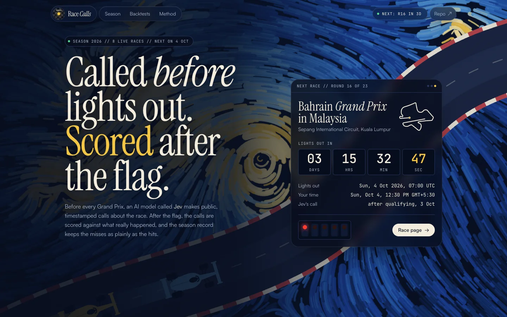

*The front page hero, with the next race's countdown card.*

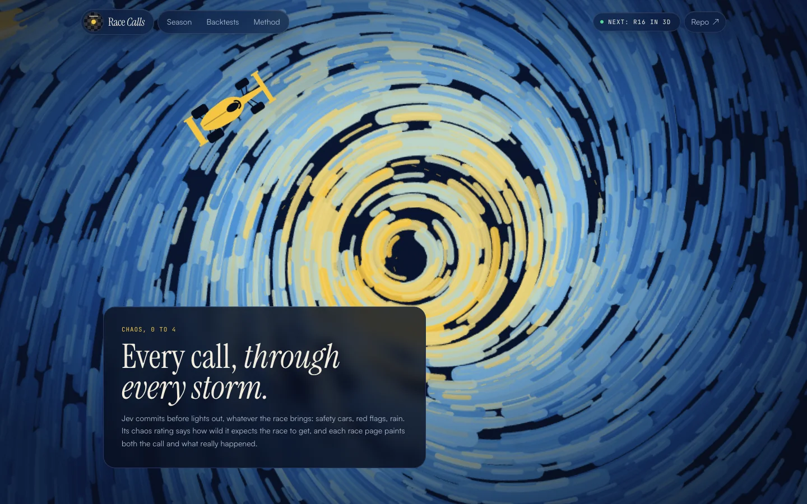

*The storm band, which introduces the chaos rating.*

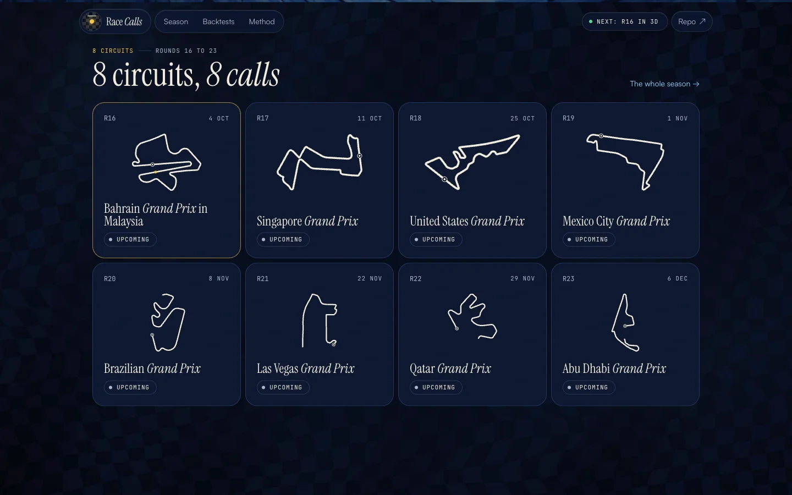

*The eight live circuits, each linking to its race page.*

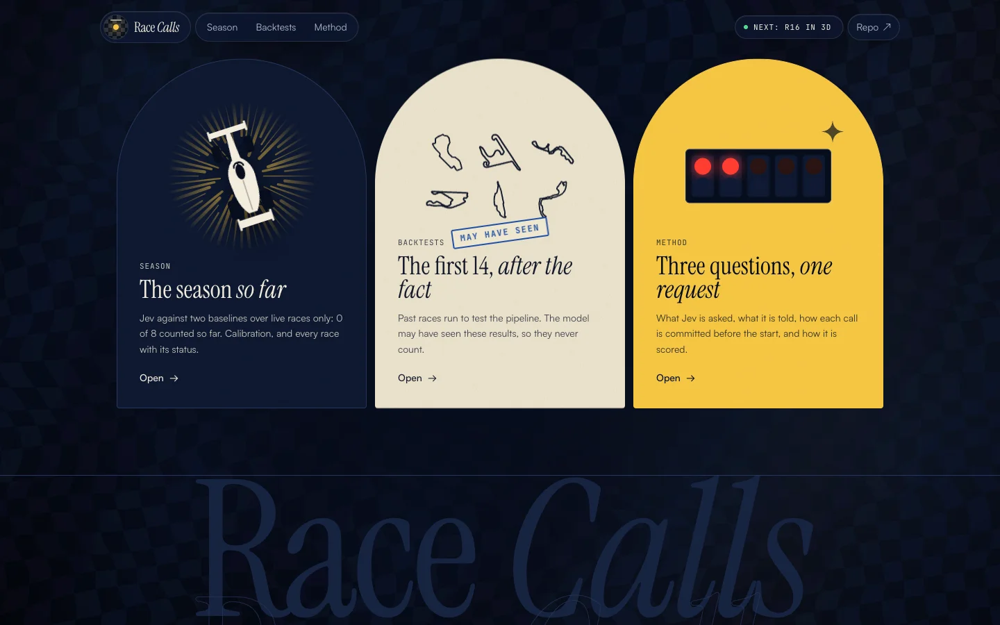

*The three ways into the record.*

From top to bottom:

- **The hero.** The headline "Called before lights out. Scored after the flag.", a two-sentence explanation of Jev, and the next race's card (`home/NextRaceCard.tsx`): the circuit outline drawing itself in, the countdown to lights out, and when the call is due. The pick itself is never shown here, so the front page cannot spoil a race. The hero fills the screen and closes into a rounded card as you scroll.
- **The ticker** (`home/Ticker.tsx`), a decorative strip of what the site does.
- **The storm band** (`home/StormBand.tsx`): a full-screen vortex painting that a small generic car travels along as you scroll. Scrolling back runs it in reverse; nothing moves on its own.
- **The circuits**: one tile per live race (rounds 16 to 23 of 2026) with its circuit outline, date, and [status](#race-status). Each links to its race page.
- **Three doors** to the Season, Backtests, and Method pages. The Season door says how many live races have counted so far.

## Season (`/season`)

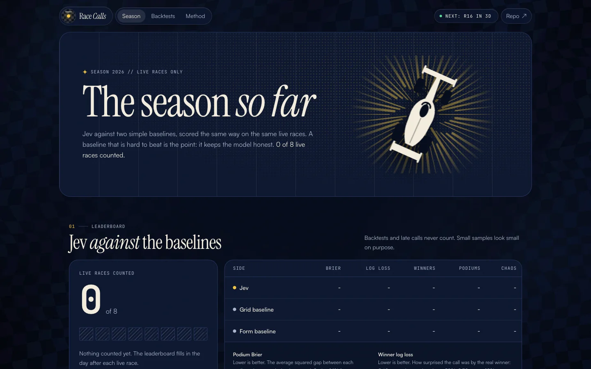

*The season page opens with the leaderboard over live races only.*

The season page is about the live races only: the ones Jev called in public before lights out. It has five numbered sections:

1. **Leaderboard**: Jev against the two baselines. See [the leaderboards](#the-leaderboards-and-their-companion-views).
2. **Technical**: every live race, every measure.
3. **Calls vs reality**: what Jev said next to what happened.
4. **Calibration**: when Jev said 70%, did it happen?
5. **Races**: every live race as a timing tower row (`season/RaceTower.tsx`) with its status pill, followed by a key to what each status means (`season/StatusKey.tsx`). No picks appear here; they stay behind each race's reveal button.

Before the first live race is scored, each section says so in words rather than showing an empty table ("Nothing counted yet. The leaderboard fills in the day after each live race.").

## Backtests (`/backtests`)

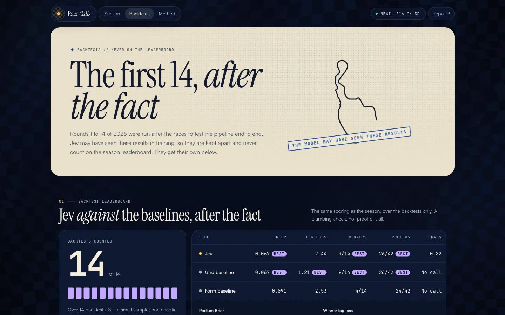

*The backtests page, set on paper so it never looks like the live season.*

The first 14 races of 2026 were run after they happened, to test the pipeline end to end. Jev may have seen those results in training, so a good score there may be memory rather than skill. The page is labelled that way in its header, its stamp, and every leaderboard footnote, and it is printed on the paper surface rather than the night sky, so it is visually a different place from the season.

It has the same five sections as the season page, computed over the backtests only: backtest leaderboard, technical board, calls against reality, calibration, and a grid of poster tiles, one per backtest (round number, date, circuit outline, and "Scored", "Called", "Failed", or "No prediction"). Each tile links to `/backtest/:round`. Only records with `status` "ok" that are not late and have a score count toward the boards.

## The leaderboards and their companion views

The season and backtest pages use the same four components, given different races. The season passes only live, on-time, scored races; the backtests page passes only scored backtests. The two sets never mix (see [honesty rules](#honesty-rules-the-site-enforces)).

### Leaderboard

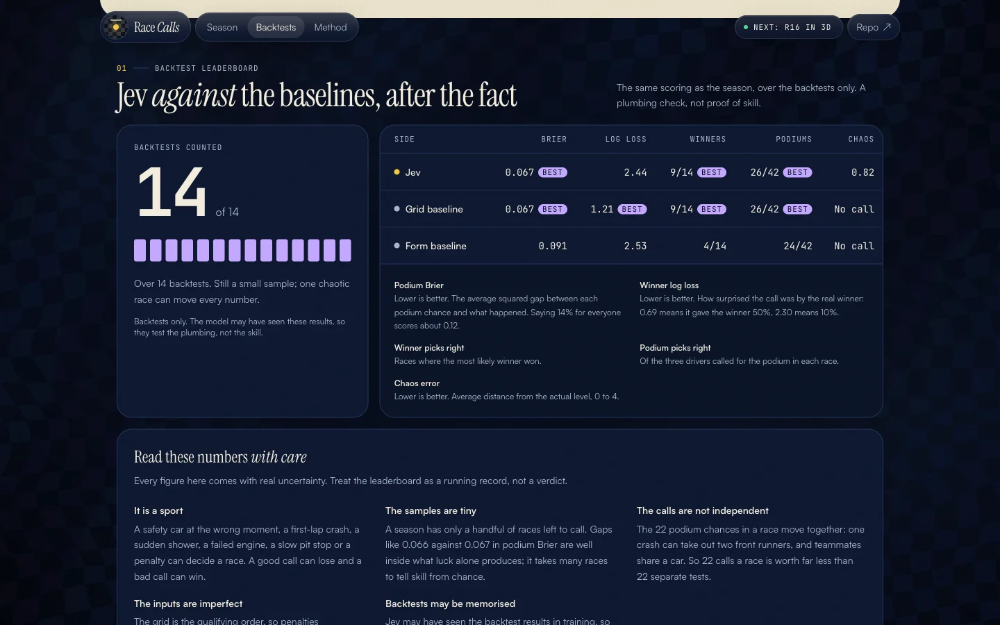

*The backtest leaderboard: the count of races is the loudest number, so a small sample looks small.*

`season/Leaderboard.tsx`. On the left, the number of races counted, in very large type, with one block per race of the season (filled when counted, hatched when not) and a plain-words note on the sample size: under five races it says "far too few to separate skill from luck". On the right, a table with one row per side (Jev, grid baseline, form baseline) and five columns:

| Column | Shown as | Better |
| --- | --- | --- |
| Podium Brier | mean over races, three decimals | lower |
| Winner log loss | mean over races, two decimals | lower |
| Winner picks right | hits out of races, e.g. `4/14` | higher |
| Podium picks right | hits out of three per race, e.g. `27/42` | higher |
| Chaos error | mean over races, two decimals; "No call" for the baselines, which make no chaos call | lower |

The best side in each column gets a purple "Best" tag. Ties are judged on the figures as shown, so 0.064 and 0.064 are both best, and no tag appears when every side ties or only one side has a figure. Each column is explained in one plain sentence underneath. The formulas themselves are in [scoring.md](scoring.md). On phones the table becomes one card per side.

**The uncertainty note.** Directly under each leaderboard sits "Read these numbers with care" (`season/Uncertainty.tsx`), five short reasons every figure is uncertain: it is a sport (a safety car can decide a race), the samples are tiny, the 22 podium chances in a race are not independent, the inputs are imperfect (the grid predates later penalties, the history predates the 2026 rules), and backtests may be memorised. It is there so that a reader treats the board as a running record, not a verdict.

### Technical board

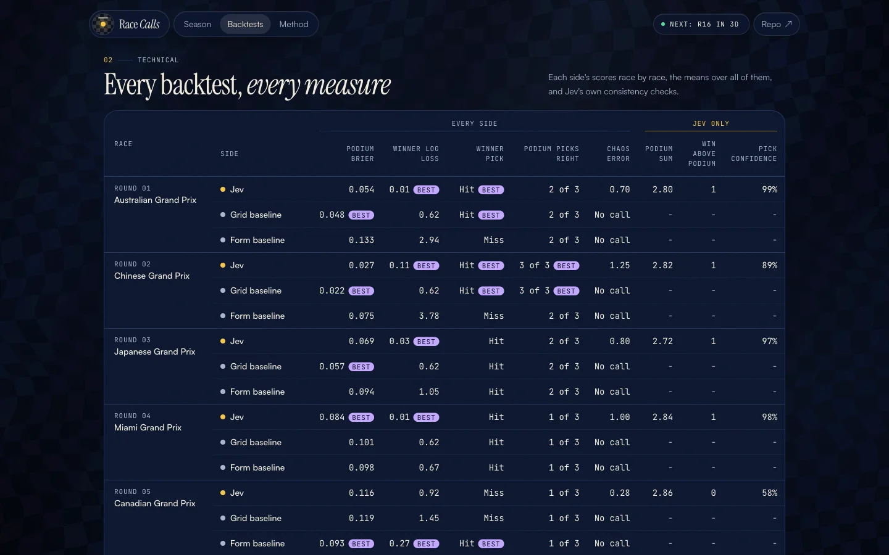

*The technical board over the backtests: every race, every measure, then the means.*

`season/TechnicalBoard.tsx`, fed by `technical()` in `data/technical.ts`. Where the leaderboard gives only the totals, this table shows the working:

- **One block per race**, three rows (Jev, grid baseline, form baseline), with the same five measures as the race scorecard for that race alone, and a "Best" tag per race.
- **Three Jev-only columns**, Jev's own consistency checks, shown as "-" for the baselines:
  - *Podium sum*: Jev's podium chances added up. Exactly three drivers finish on the podium, so the true total is 3; a sum far from 3 means the separate yes or no answers do not fit together.
  - *Win above podium*: how many drivers were given a higher win chance than podium chance, which cannot happen (winning implies a podium). 0 is right.
  - *Pick confidence*: Jev's own stated confidence in its winner pick.
- **A totals block** at the foot: each side's means (Brier, log loss, chaos error) and hit totals over the same races, with "Best" tags, and the Jev-only columns averaged over the races.
- **The podium calibration error** under the table: the count-weighted mean gap between the chance Jev said and how often it happened, over the same ten bands as the calibration chart, with the number of podium chances it is based on. 0 is perfectly calibrated.

A "How to read this" list defines every column. The table is wider than a phone, so it scrolls sideways inside its own frame with the race column pinned, and the page itself never scrolls sideways.

### Calls vs reality

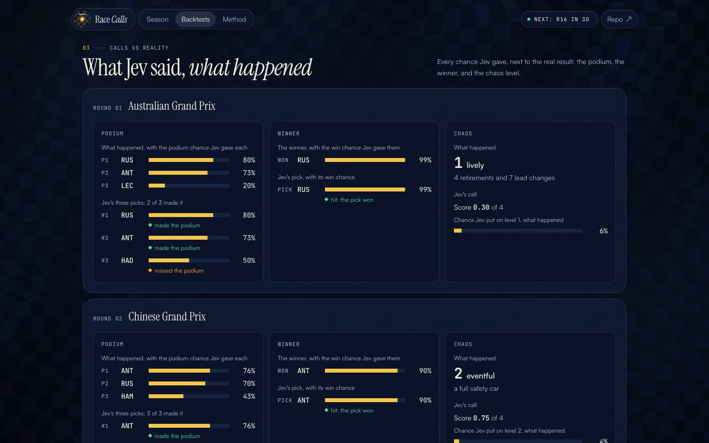

*Calls against reality: for every race, the chance Jev gave to what actually happened.*

`season/CallsVsReal.tsx`, fed by `callsVsReal()` in `data/technical.ts`. The measures above compress a race into a few numbers; this view shows the raw calls instead. One card per scored race, with three panels:

- **Podium.** The real P1, P2, and P3, each with the podium chance Jev gave that driver; then Jev's three podium picks, each marked "made the podium" or "missed the podium", with a count ("2 of 3 made it").
- **Winner.** The real winner with the win chance Jev gave them, and Jev's pick with its win chance, marked hit or miss.
- **Chaos.** The actual level (0 to 4), its one-word name, and the reason in plain words (for example a red flag); then Jev's score on the 0 to 4 scale and the chance Jev put on the level that actually happened. That last figure comes from `chaos_levels`, the one part of Jev's raw response the build keeps (see [how data gets in](#how-data-gets-in)); records without it say "Not recorded for this race."

Every chance has both a bar to scan by and a percent to read, and every verdict is written in words, so colour is never the only signal.

### Calibration

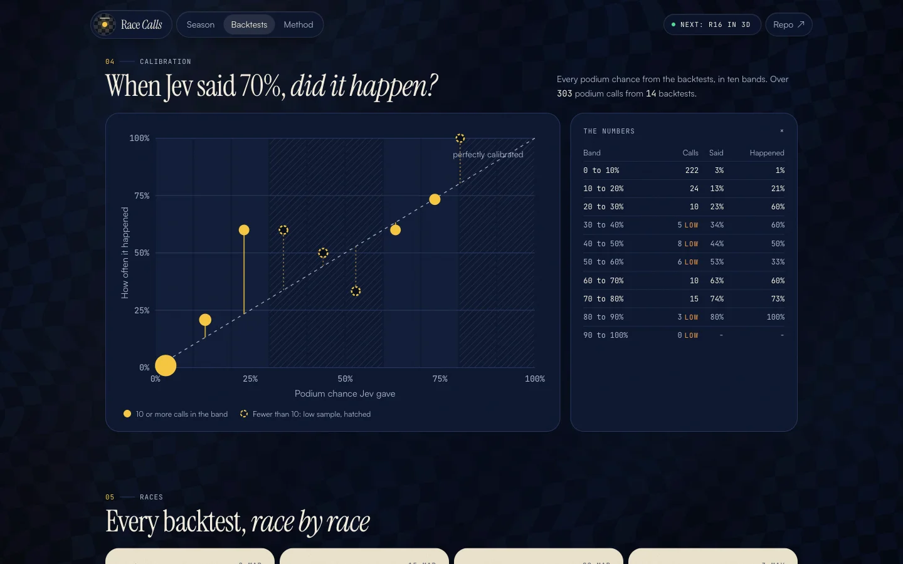

*Calibration over the backtests: points on the diagonal mean "when Jev said 30%, it happened about 30% of the time".*

`season/Calibration.tsx`. Every podium chance from the counted races is put into one of ten equal bands (0 to 10%, 10 to 20%, and so on). Each band becomes a point: across, the average chance Jev gave; up, how often those drivers really made the podium. A well calibrated caller sits on the dashed diagonal, and a short line from the diagonal to each point shows that band's miss. Point size grows with the number of calls in the band. Bands with fewer than ten calls are drawn hollow and hatched and marked "low" in the table, because a band of three calls says almost nothing. The same numbers are in a table beside the chart. The banding mirrors the pipeline's own metrics (`metrics.py`): a probability is clamped to 0 to 1 and floored into its band.

## Method (`/method`)

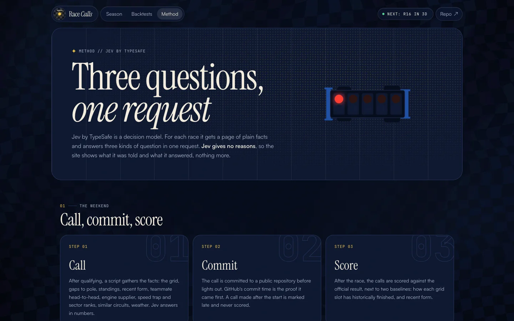

*The method page: what Jev is asked, how a call is committed, and how it is judged.*

`pages/Method.tsx`, four sections: the weekend (call, commit, score), the three questions (podium chance, winner pick, chaos rating), how a call is judged (the measures in one sentence each), and the house rules, listed in plain words: every call is public before lights out, a late call is never scored, "no prediction" when data does not arrive, backtests never count, the grid is provisional, and misses are shown as plainly as hits. It states up front that Jev gives no reasons.

## Race pages (`/race/:round` and `/backtest/:round`)

`pages/RacePage.tsx` looks up the record for the round and kind:

- A record exists: it renders `pages/RaceView.tsx`.
- No record, but the round is on the live calendar (`data/calendar.ts`): it renders `pages/UpcomingRace.tsx`, which shows a countdown and when the call is due, or, once the start has passed, "No prediction: no call was committed before lights out".
- Otherwise: not found.

The page is keyed per race, so the reveal state and its timers never carry over from one race to the next. The sections below appear in this order; their numbers ("01", "02", ...) are assigned as they render, so a race without a result simply has fewer.

### The poster and the reveal button

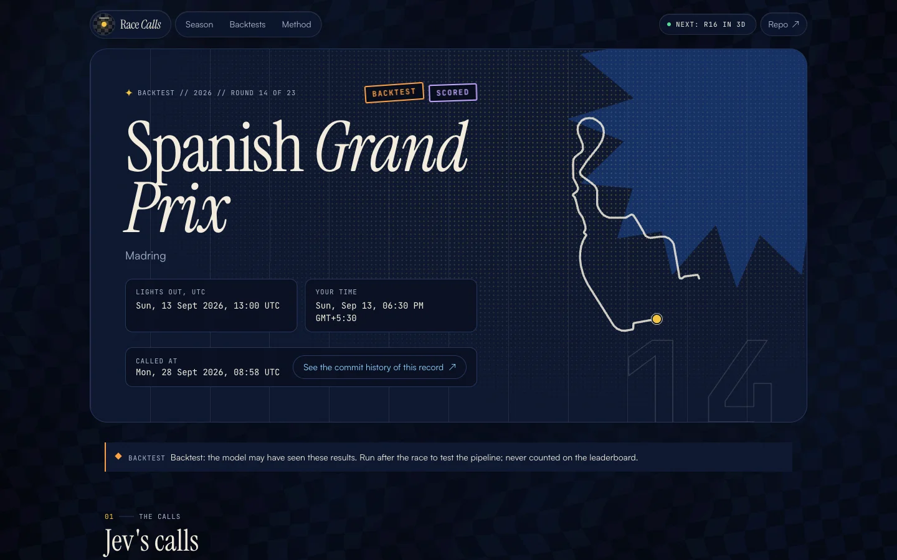

*A race page before the reveal: the proof of timing, and the calls kept under wraps.*

The poster (`RaceHero.tsx`) shows kind, season, and round, the race name, circuit, and lights out in UTC and in the visitor's own time zone, with status stamps (Backtest, Late, No call, Failed, Scored). Under it, **the proof**: when the call was made, "Before lights out" or "After the start" for live races, and a link to "See the commit history of this record" on GitHub. GitHub's commit time is the evidence that the call came first, which is why the link is on every race page. Status banners follow in words: backtest, late, on time, no prediction, or failed.

Then **the spoiler guard** (`race/RevealGate.tsx`). The calls, and after the race the result, are hidden until you click "Show Jev's calls" (or "Show Jev's calls and the result" once the race is scored, because the calls give away who won). The button runs a start sequence, five lights on and then out, and then reveals the page; under reduced motion it reveals at once. The page says plainly that the calls are public in the repository anyway; the guard only keeps them off your screen until you ask. The choice is remembered for the browser session, per race (`race/useReveal.ts`, in `sessionStorage`). After the reveal, keyboard focus moves to the "Jev's calls" heading so keyboard and screen reader users land on what just appeared.

Once revealed, the first section is **Jev's calls at a glance** (`race/Headline.tsx`): the winner pick with its win chance, Jev's podium (the three highest podium chances, drawn as a podium), and the chaos score with its word from the rubric. After the race each card gains a verdict in words: Hit or Miss, "On podium" or "Missed" under each podium pick, and the actual chaos level with its reason.

### Grid

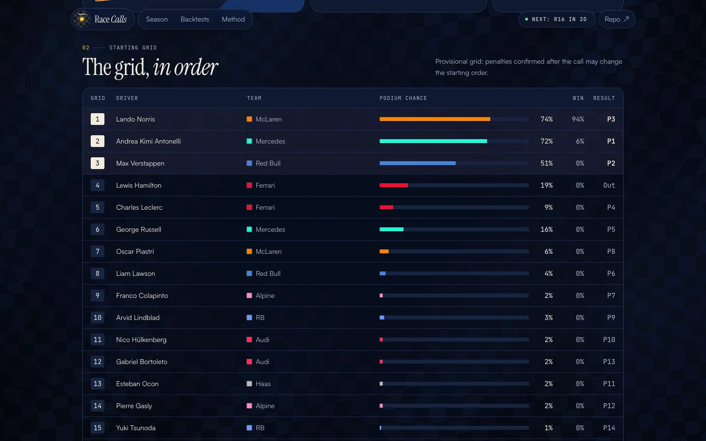

*The grid in starting order, with each driver's podium and win chance once revealed.*

`race/GridTable.tsx`. The grid shows before the reveal too, with the chance columns hatched out, so you can make your own guess first. After the reveal each row gets a podium chance bar in the team's colour with its percent, and the win chance; after the race, where the driver finished. The section says whether the grid is provisional ("penalties confirmed after the call may change the starting order") or final.

Under it, **two consistency checks** (`race/Consistency.tsx`) on Jev's raw answers: what the podium chances add up to against the true number, 3 (each chance is a separate yes or no question, so they need not add up, but a big gap is informative), and any driver given a higher win chance than podium chance, flagged because it is impossible.

### Winner distribution

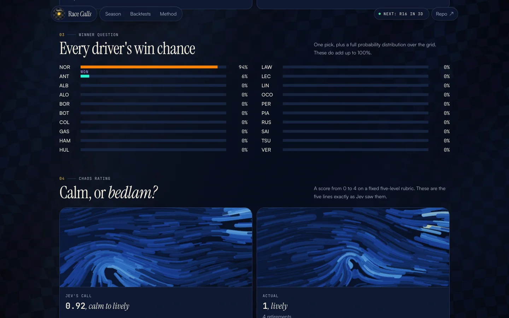

*The winner question in full: one pick, plus a probability for every driver that adds up to 100%.*

`race/Distribution.tsx`. Every driver's win chance, most likely first. After the race the real winner is marked "Won".

### Chaos

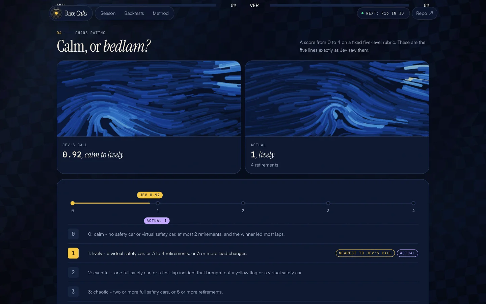

*The chaos rating: Jev's call painted beside the actual level, and the rubric exactly as Jev saw it.*

`race/ChaosPaintings.tsx` and `race/Chaos.tsx`. The chaos score is painted: long calm strokes at 0, tight broken vortices at 4, so "Jev called calm, the race was bedlam" is visible at a glance. After the race a second painting shows the actual level with its reason. The paintings are decorative and each is labelled in text. Below them, Jev's score on a 0 to 4 track and **the five rubric lines exactly as they were sent to Jev**, read from the recorded request, with "Nearest to Jev's call" and "Actual" marked.

### After the flag

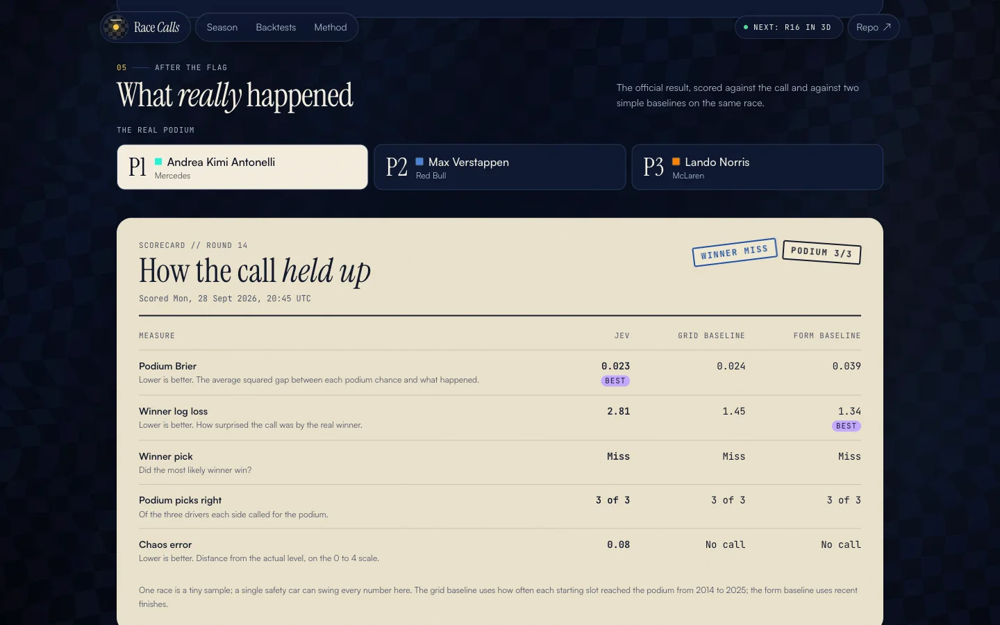

*After the flag: the real podium, the scorecard, and each call next to what happened.*

`race/AfterRace.tsx`, shown only when the race is scored and the call was on time:

- **The real podium**, P1 to P3.
- **The scorecard**, printed on paper: Winner hit or miss and podium hits as stamps, then a table of the five measures for Jev, the grid baseline, and the form baseline side by side, each explained in one line, with "Best" tags. A note says what the baselines are and that one race is a tiny sample.
- **Called against what happened**: every driver's podium chance next to where they finished, with Jev's three picks marked. Drivers who made the podium are shaded purple. Two verdicts are written out: "Confident miss" (Jev gave 50% or more and the driver did not make the podium) and "Surprise podium" (under 20% and they did). This is the list that makes a confident miss as plain as a hit.

### What Jev knew

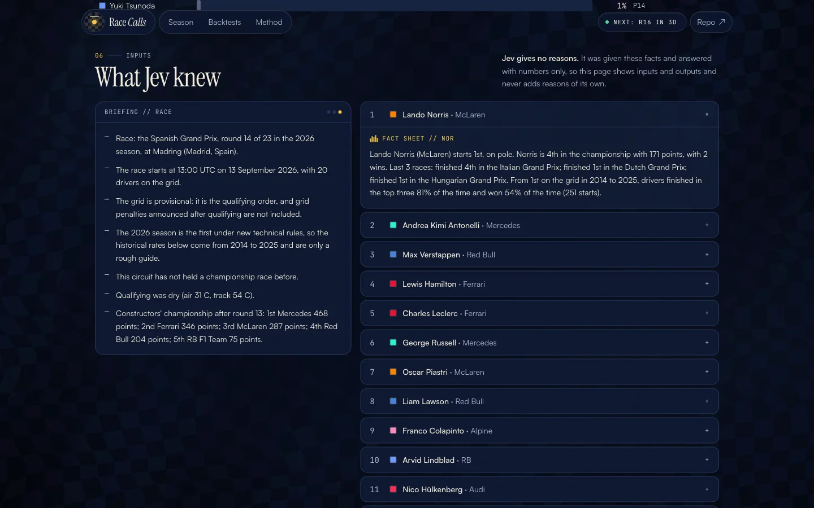

*The exact facts Jev was given for this race, because Jev gives no reasons.*

`race/Facts.tsx`. Jev answers with numbers only; it never explains itself. So instead of inventing reasons, the page shows its inputs: the race briefing lines and, per driver, the fact line that was sent (grid slot, championship position, recent finishes, historical rates from that slot, and so on), each in an expandable row. These come verbatim from the recorded snapshot. How the facts are built is in [pipeline.md](pipeline.md).

### Small print

At the foot of the page (`race/SmallPrint.tsx`): the model id, provider, tokens in and out, latency, cost, request time, and the SHA-256 hash of the exact request body. A reader can check that a record has not been swapped for a different request after the fact.

## How data gets in

Nothing is fetched at run time. The path from committed JSON to the page is:

1. **At build time**, the Vite plugin in `web/plugins/predictions.ts` walks `../predictions/` and `../scores/` (the repository root, outside the web folder), parses every `.json` file, and exposes them as two virtual modules, `virtual:predictions` and `virtual:scores`. Each is a map from repository path (for example `predictions/backtest/14-spanish-grand-prix.json`) to the parsed record. A file that is not valid JSON is skipped with a build warning; a missing folder is an empty module, so the site builds before any live race exists.
2. **Prediction records are slimmed** on the way in (`src/data/slim.ts`), so only what the site shows reaches the bundle. From each record it **drops** the raw `response`, the `snapshot_text`, the `extra` block, and every part of the `request` except the chaos rubric. It **keeps** everything else (race, timing, status, `late`, drivers, `calls`, the `jev` metadata, `request_hash`, `note`, `grid_provisional`), plus three things pulled out of the dropped parts:
   - `request.questions.chaos.criteria`: the five rubric lines exactly as Jev saw them;
   - `facts`: the race briefing lines and one fact line per driver, from `extra.snapshot`;
   - `chaos_levels`: Jev's chance for each chaos level "0" to "4", from `response.answers.chaos.probabilities`, left out when a record has none.
   
   Score records pass through unchanged. Slimming matters for two reasons: the raw request and response are large and would bloat every page load, and the less raw provider output is bundled, the less there is to leak.
3. **At load**, `src/data/load.ts` checks each entry with a small runtime guard. `isRecord` requires the fields every page relies on (season, round, slug, race name, circuit, race start, kind, status, made at, late) with the right types, a known `schema_version`, and `drivers` and `calls` of the right shape if present. `isScoreRecord` in `src/data/scores.ts` requires the result, the chaos level and reason, and a complete score for each of Jev, grid, and form. Anything that fails is skipped with a console warning ("not a prediction record this site can read") rather than crashing the page, so a record from a future schema simply does not appear. A skipped score file means its race shows as "Called" rather than "Scored". The deeper structure is trusted because the pipeline writes it through its own validated pydantic models.
4. Scores are matched to records by season, round, and kind.

During `pnpm dev` the plugin watches both folders and reloads the page when a record is added, changed, or removed.

## Race status

Every live race has exactly one status, computed by `raceStatus()` in `src/data/season.ts` from the record (if any), the score (if any), the race start, and the current time. The checks run in this order, and the first that matches wins:

| Status | Shown as | When | Dot |
| --- | --- | --- | --- |
| upcoming | Upcoming | no record, and the race start is still ahead | grey |
| no prediction | No prediction | no record and the start has passed, or the record's status is `no_prediction` (qualifying data did not arrive in time) | hollow ring |
| failed | Failed | the record's status is `failed` (the request to Jev failed) | red |
| late | Late, not scored | the record's `late` flag is set: made after the start | amber |
| called | Called | an on-time call with no score yet | green |
| scored | Scored | an on-time call with a score | purple |

The status is always written in words next to its coloured dot (`StatusPill.tsx`), so colour is never the only signal. The order matters: a late record is "late" even if a score file exists for it, which is how the site keeps late calls off the board. The backtest tiles use a shorter label from the record's status and whether a score exists.

## What the site computes and what it reads

The per-race scores are computed once, by the pipeline, and read from the score files. The site does not recompute them. What it does compute is either aggregation over those scores or presentation of the calls themselves.

| From the score files | Computed in the browser |
| --- | --- |
| Each side's podium Brier, winner log loss, winner hit, podium pick and hits, and chaos error for one race | Race status (`season.ts`) |
| The official result: winner, podium, every driver's classification | Leaderboard means and totals over the counted races (`leaderboard()`) |
| The actual chaos level and its reason | Calibration bands and the podium calibration error (`reliability()`, `podiumEce()`) |
| When the race was scored | Jev's podium as displayed: the three highest podium chances, ties broken by driver code (`podiumPick()` in `record.ts`) |
| | The podium sum and win-above-podium checks, per race and averaged |
| | "Best" tags, the "Confident miss" and "Surprise podium" verdicts, and the chance Jev put on the actual chaos level |
| | Rubric words for a chaos level ("calm to lively" for 0.92), from the rubric in the record |

Keeping the per-race scoring in one place (the pipeline, tested in Python) means the site cannot quietly disagree with the committed score. The site's leaderboard is only a mean of those numbers, and its calibration bands copy the pipeline's rule so the chart matches the pipeline's metrics.

## Honesty rules the site enforces

These are enforced in code and covered by tests (`src/pages/Season.test.tsx`, `src/pages/RaceView.test.tsx`, `src/data/season.test.ts`), not just stated:

- **A late call is never shown as scored.** `raceStatus()` returns "late" before it ever looks at the score, `countedScores()` only takes "scored" rows, and `RaceView` drops the score for a late record, so a late race gets no scorecard, no result section, and no "Scored" stamp even if a score file exists. It is published and labelled "Made after the start: published, not scored."
- **Backtests never appear on the season board.** `seasonRows()` matches only `kind: "live"` records and scores against the live calendar, so a backtest cannot enter the season leaderboard, technical board, calls view, or calibration. The backtests page builds its own boards from backtests only, and says in each footnote that they test the plumbing, not the skill.
- **Backtests are labelled everywhere**: the page header, a stamp, each backtest race page's banner ("the model may have seen these results"), and the leaderboard footnote.
- **Small samples look small.** The number of races counted is the largest figure on each leaderboard, and the note beside it says how little a handful of races can show.
- **No invented reasons.** Jev gives none, so the site shows inputs ("What Jev knew") and outputs, and adds no explanation of its own.
- **No prediction is a state, not a gap.** A race with no call says so in words.
- **The proof is one click away.** Every race page links to the commit history of its record.

## Visual system

The look is described in the OpenSpec change `openspec/changes/starry-night-theme-and-scroll/` and in [ui-brief.md](ui-brief.md). Briefly:

- **The "Starry Night" theme**: a night palette of deep blues with chrome yellow light (`--color-star`), cobalt and cerulean accents, and a warm paper surface for printed things (the scorecard and the backtests). The tokens live in `web/src/index.css`, each with its measured contrast in a comment. Sector colours carry states: purple for best or scored, green for on time or a hit, amber for late or a miss, red for failed.
- **Painted art**: generative brushstrokes along a vortex flow field, drawn on a `<canvas>` (`components/art/painting/`), original and seeded so a painting is the same on every visit. No images, no copied artwork. Art is always decorative: it is hidden from assistive technology and its meaning is said in nearby text.
- **Type**: Satoshi for text, loaded from the Fontshare CDN in `index.html` because its licence does not allow the font files in a public repository; Instrument Serif for display headings; JetBrains Mono with tabular numerals for every number, so columns of figures line up.
- **Team colours** (`data/teams.ts`) are used for swatches and bar fills only, never for text, so contrast never depends on a team's colour. Each fill is at least 3:1 against the bar track.
- **No series marks**: no series name, logos, liveries, or driver photos. Team names are shown without the series name. The cars are generic shapes.
- **Motion** follows the reader: the hero closes into a card and the storm band scrubs with scroll (CSS scroll-driven animations), and Lenis smooths wheel and touch scrolling. Under reduced motion, or in browsers without scroll timelines, everything falls back to a static layout.

## The key-free build check

The site is public, and every byte of `dist/` is sent to every visitor. `pnpm build` ends with `node scripts/check-no-secrets.mjs`, which:

1. collects the value of every variable whose name ends in `_API_KEY` from the environment and from the repository root `.env` (values under 16 characters are ignored, since they would match ordinary text);
2. searches every file under `dist/` for each value, and for anything shaped like an OpenRouter key (`sk-or-v1-` followed by hex);
3. on a hit, prints only the file name and the variable's **name**, never any part of the value, and exits with an error, failing the build.

The data path is designed so this should never fire (the pipeline never writes a key into a record, and slimming drops the raw request and response), but the check makes that a tested guarantee rather than a hope. It has its own tests in `scripts/check-no-secrets.test.mjs`.

## Accessibility

The target is WCAG 2.2 AA:

- **Contrast is measured, not eyeballed.** `src/data/palette.test.ts` checks every text and state colour pair against AA.
- **Colour is never the only signal.** Statuses, verdicts, "Best", hits, and misses are all written in words.
- **Charts have text.** The calibration chart has a description and the same numbers in a table; the chaos paintings are labelled in text; the grid table has a caption that changes with the reveal.
- **Keyboard.** A "Skip to content" link, visible focus outlines, focus moved to the calls after the reveal, and the technical board's scroll area can be focused and scrolled with the keyboard.
- **360px wide with no horizontal page scroll.** Tables turn into cards or scroll inside their own frame on phones.
- **Reduced motion** is honoured everywhere: the reveal is instant, the scroll effects are static, and Lenis is off.
- **Keyboard shortcuts can be switched off.** The easter eggs' letter-key sequences can misfire for speech input users, so the footer has a "Keyboard secrets on/off" switch (WCAG 2.1.4).

## Easter eggs

A few small "paddock secrets" (`components/eggs/`): typed sequences and taps on the logo start short scenes, such as Jev on the team radio (still giving no reasons), a pit stop, a safety car, and the start lights, and the footer's chequered flag waves when you reach the end of a page. They never block the page, can be closed with Escape, announce themselves once to screen readers, and remember what you have found in this browser only.
